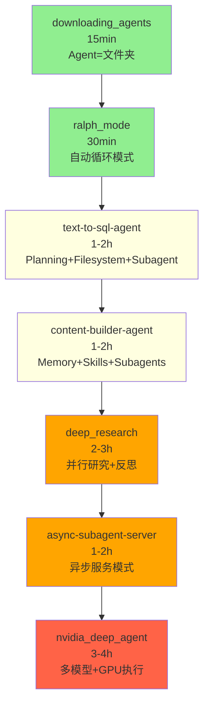

# 📚 Deep Agents Examples 学习指南

本文档提供 Deep Agents 项目中 `/examples` 目录的学习路径建议，帮助开发者循序渐进地掌握 Deep Agent 开发。

---

## 📊 学习路线概览



**总学习时间**：约 10-12 小时  
**示例数量**：7 个  
**难度分级**：入门 → 进阶 → 高级 → 专家

---

## 🟢 入门级（必学基础）

### 1️⃣ downloading_agents

**⏱️ 学习时间**：15 分钟  
**🎯 学习重点**：理解 Deep Agent 的核心理念  
**📍 位置**：`examples/downloading_agents/`

#### 核心概念

- ✅ **Agent 就是文件夹**：AGENTS.md + skills/ 目录
- ✅ **无需代码即可定义 Agent**：完全通过文件配置
- ✅ **下载即用模式**：zip 解压即可运行

#### 为什么第一个学

这是最简单的示例，帮你建立"Agent 即文件夹"的心智模型。展示了 Deep Agent 最基本的理念：**Agent 不需要复杂的代码，只需要正确的文件结构**。

#### 快速体验

```bash
# 创建项目文件夹
mkdir my-project && cd my-project && git init

# 下载 Agent
curl -L https://raw.githubusercontent.com/langchain-ai/deepagents/main/examples/downloading_agents/content-writer.zip -o agent.zip

# 解压到 .deepagents 目录
unzip agent.zip -d .deepagents

# 运行
deepagents
```

#### 目录结构

```
.deepagents/
├── AGENTS.md                    # Agent 记忆和指令
└── skills/
    ├── blog-post/SKILL.md       # 博客写作工作流
    └── social-media/SKILL.md    # 社交媒体工作流
```

#### 学习收获

理解 Deep Agent 的核心设计哲学：**约定优于配置，文件优于代码**。

#### 📖 学习方法与建议

**第1步：快速体验（5分钟）**
```bash
# 直接运行现成的 Agent
mkdir test-agent && cd test-agent
curl -L https://raw.githubusercontent.com/langchain-ai/deepagents/main/examples/downloading_agents/content-writer.zip -o agent.zip
unzip agent.zip -d .deepagents
deepagents
```

**第2步：探索文件结构（5分钟）**
```bash
# 查看目录结构
tree .deepagents

# 阅读 AGENTS.md
cat .deepagents/AGENTS.md

# 查看技能文件
ls .deepagents/skills/
cat .deepagents/skills/blog-post/SKILL.md
```

**第3步：自定义尝试（5分钟）**
```bash
# 修改 AGENTS.md 改变 Agent 行为
echo "\n## Additional Rules\n- Always use emojis in responses" >> .deepagents/AGENTS.md

# 重新运行，观察变化
deepagents
```

**关键关注点**：
- ✅ AGENTS.md 的格式和内容结构
- ✅ skills/ 目录的组织方式
- ✅ 无需代码即可定义 Agent 的威力

**实践建议**：
1. 尝试修改 AGENTS.md 添加自定义规则
2. 创建自己的 skill 文件（如 `skills/my-skill/SKILL.md`）
3. 打包分享给朋友试用

**调试技巧**：
- 使用 `--verbose` 参数查看 Agent 加载了哪些文件
- 检查 `.deepagents/` 目录结构是否正确
- 确保 AGENTS.md 使用 UTF-8 编码

**扩展思路**：
- 为不同项目创建不同的 Agent 配置
- 建立团队共享的 Agent 配置库
- 探索如何版本控制 Agent 配置

---

### 2️⃣ ralph_mode

**⏱️ 学习时间**：30 分钟  
**🎯 学习重点**：理解自动循环模式  
**📍 位置**：`examples/ralph_mode/`

#### 核心概念

- ✅ **无限循环模式**：fresh context（每次循环清空上下文）
- ✅ **文件系统作为记忆**：通过文件持久化进度
- ✅ **非交互式执行**：适合自动化任务

#### 为什么第二个学

展示了一个完全不同的 Agent 运行模式——**无需人工干预的自动化执行**。Ralph 模式由 Geoff Huntley 创造，核心理念是：**每次循环都用全新的上下文，通过文件系统追踪进度**。

#### 快速体验

```bash
# 安装 CLI
uv pip install deepagents-cli

# 下载脚本
curl -O https://raw.githubusercontent.com/langchain-ai/deepagents/main/examples/ralph_mode/ralph_mode.py

# 无限循环（Ctrl+C 停止）
python ralph_mode.py "Build a Python programming course for beginners. Use git."

# 限制迭代次数
python ralph_mode.py "Build a REST API" --iterations 5

# 指定模型
python ralph_mode.py "Create a CLI tool" --model claude-sonnet-4-6

# 使用远程沙箱
python ralph_mode.py "Build an app" --sandbox modal
```

#### 工作原理

```
1. 你提供任务 → 声明式描述（做什么，不是怎么做）
2. Agent 执行 → 创建文件，推进进度
3. 循环重复 → 相同的提示，文件持续存在
4. 你停止 → 满意后 Ctrl+C
```

#### 学习关键

- 理解为什么用"fresh context"避免上下文溢出
- 学习如何让 Agent 持续工作而不需要人工干预
- 掌握文件系统作为持久化记忆的模式

#### Ralph 原始实现

```bash
while :; do cat PROMPT.md | agent ; done
```

#### 📖 学习方法与建议

**第1步：理解原理（10分钟）**
```bash
# 阅读 ralph_mode.py 源码
cat ralph_mode.py | head -50

# 关键：理解 fresh context 模式
# 每次循环都清空对话历史，只保留文件系统状态
```

**第2步：简单实验（10分钟）**
```bash
# 创建测试项目
mkdir ralph-test && cd ralph-test
git init

# 运行 Ralph（限制 3 次迭代）
python ../ralph_mode.py "Create a simple Flask app with one endpoint" --iterations 3

# 观察文件变化
git status
git log --oneline
```

**第3步：深入观察（10分钟）**
```bash
# 查看每次迭代的输出
# 注意：Agent 如何通过 git commit 追踪进度

# 查看生成的文件
cat app.py  # 或其他生成的文件

# 查看 git 历史
git log --graph --oneline --all
```

**关键关注点**：
- ✅ 理解为什么用 fresh context（避免上下文溢出）
- ✅ 观察文件系统如何作为持久化记忆
- ✅ 学习 Agent 的自我迭代和改进模式

**实践建议**：
1. **从简单任务开始**：先尝试生成小项目，观察 Ralph 如何工作
2. **设置迭代限制**：使用 `--iterations` 参数控制成本
3. **监控文件变化**：使用 `git status` 和 `git diff` 观察进度
4. **适时中断**：满意后立即 Ctrl+C，避免无谓的迭代

**调试技巧**：
```bash
# 启用详细日志
export LANGCHAIN_TRACING_V2=true
python ralph_mode.py "..." --iterations 2

# 查看 LangSmith 追踪
# 分析每次迭代中 Agent 的决策过程
```

**最佳实践**：
1. **清晰的任务描述**：声明式描述做什么，不是怎么做
2. **使用版本控制**：让 Ralph 使用 git 追踪进度
3. **设置合理期望**：Ralph 适合探索性任务，不适合精确需求
4. **监控成本**：每次迭代都会调用 LLM，注意 API 费用

**扩展思路**：
- 将 Ralph 模式集成到 CI/CD 流程
- 创建 Ralph 任务队列，批量处理项目
- 探索 Ralph 模式在代码重构中的应用
- 结合 LangSmith 追踪，优化迭代策略

**常见问题解决**：
```bash
# 问题1：迭代过多成本高
Solution: 使用 --iterations 参数限制

# 问题2：Agent 重复相同错误
Solution: 在任务描述中明确约束条件

# 问题3：生成的代码质量不稳定
Solution: 提供更详细的任务要求和示例
```

---

## 🟡 进阶级（核心功能）

### 3️⃣ text-to-sql-agent

**⏱️ 学习时间**：1-2 小时  
**🎯 学习重点**：掌握 Deep Agent 的三大核心能力  
**📍 位置**：`examples/text-to-sql-agent/`

#### 核心概念

- ✅ **Planning**：`write_todos` 工具分解复杂任务
- ✅ **Filesystem**：文件读写、保存上下文
- ✅ **Subagent**：委托专门任务

#### 为什么第三个学

这是完整展示 Deep Agent SDK 核心功能的示例。你将看到 Agent 如何：
1. **计划**：使用 `write_todos` 分解任务
2. **执行**：调用 SQL 工具查询数据库
3. **持久化**：使用文件系统保存中间结果
4. **委托**：可选的子 Agent 任务分配

#### 架构图

```
User Question
     ↓
Deep Agent (with planning)
     ├─ write_todos (plan the approach)
     ├─ SQL Tools
     │  ├─ list_tables
     │  ├─ get_schema
     │  ├─ query_checker
     │  └─ execute_query
     ├─ Filesystem Tools (optional)
     │  ├─ ls
     │  ├─ read_file
     │  ├─ write_file
     │  └─ edit_file
     └─ Subagent Spawning (optional)
     ↓
SQLite Database (Chinook)
     ↓
Formatted Answer
```

#### 快速开始

```bash
# 1. 进入示例目录
cd examples/text-to-sql-agent

# 2. 下载 Chinook 数据库
curl -L -o chinook.db https://github.com/lerocha/chinook-database/raw/master/ChinookDatabase/DataSources/Chinook_Sqlite.sqlite

# 3. 创建虚拟环境
uv venv --python 3.11
source .venv/bin/activate  # Windows: .venv\Scripts\activate
uv pip install -e .

# 4. 配置环境变量
cp .env.example .env
# 编辑 .env 添加 ANTHROPIC_API_KEY

# 5. 运行简单查询
python agent.py "How many customers are from Canada?"

# 6. 运行复杂查询
python agent.py "Which employee generated the most revenue by country?"
```

#### 示例输出

```
Question: Which employee generated the most revenue by country?

[Planning Step]
Using write_todos:
- [ ] List tables in database
- [ ] Examine Employee and Invoice schemas
- [ ] Plan multi-table JOIN query
- [ ] Execute and aggregate by employee and country
- [ ] Format results

[Execution Steps]
1. Listing tables...
2. Getting schema for: Employee, Invoice, InvoiceLine, Customer
3. Generating SQL query...
4. Executing query...
5. Formatting results...

[Final Answer]
Employee Jane Peacock (ID: 3) generated the most revenue...
Top countries: USA ($1000), Canada ($500)...
```

#### 学习路径

1. **运行简单查询**：理解基本工作流
2. **运行复杂查询**：观察 `write_todos` 的计划过程
3. **研究 `AGENTS.md`**：理解 Agent 身份和安全规则
4. **研究 `skills/`**：理解按需加载的技能系统
5. **阅读 `agent.py`**：理解如何创建 Deep Agent

#### Progressive Disclosure 模式

```
AGENTS.md (always loaded)
├─ Agent identity and role
├─ Core principles and safety rules
└─ Communication style

skills/ (loaded on-demand)
├─ query-writing/
│  └─ SKILL.md    # SQL 查询工作流
└─ schema-exploration/
   └─ SKILL.md    # 数据库结构发现工作流
```

Agent 看到技能描述，但只在需要时加载完整的 SKILL.md 指令，保持上下文高效。

#### 📖 学习方法与建议

**第1步：快速上手（20分钟）**
```bash
# 1. 准备环境
cd examples/text-to-sql-agent
uv venv --python 3.11 && source .venv/bin/activate
uv pip install -e .

# 2. 下载数据库
curl -L -o chinook.db https://github.com/lerocha/chinook-database/raw/master/ChinookDatabase/DataSources/Chinook_Sqlite.sqlite

# 3. 配置 API 密钥
export ANTHROPIC_API_KEY="..."

# 4. 运行简单查询
python agent.py "How many customers are from Canada?"
python agent.py "List top 5 artists by sales"
```

**第2步：理解架构（30分钟）**
```bash
# 1. 阅读主代码
cat agent.py | grep -A 20 "def create_sql_deep_agent"

# 2. 研究 AGENTS.md
cat AGENTS.md

# 3. 查看技能定义
cat skills/query-writing/SKILL.md
cat skills/schema-exploration/SKILL.md

# 4. 启用 LangSmith 追踪
export LANGCHAIN_TRACING_V2=true
export LANGCHAIN_API_KEY="..."
python agent.py "Which employee generated the most revenue?"
# 访问 https://smith.langchain.com/ 查看详细追踪
```

**第3步：实践练习（40分钟）**

**练习1：简单查询**
```bash
# 运行并观察 Agent 如何工作
python agent.py "What are the top 3 genres by track count?"

# 在 LangSmith 中观察：
# - Agent 调用了哪些工具？
# - 生成了什么 SQL？
# - 执行流程是什么？
```

**练习2：复杂查询**
```bash
# 观察 write_todos 的计划过程
python agent.py "Analyze sales trends: compare revenue by country and year, identify top performers"

# 重点观察：
# - Agent 如何分解任务
# - 是否使用了文件系统保存中间结果
# - 如何综合多个查询结果
```

**练习3：修改 Agent 行为**
```bash
# 修改 AGENTS.md 添加新规则
vim AGENTS.md
# 添加："Always explain your SQL query before executing"

# 重新运行，观察行为变化
python agent.py "How many tracks are in each genre?"
```

**关键文件关注点**：
1. **agent.py**（核心实现）
   ```python
   # 重点关注：
   - create_sql_deep_agent() 函数
   - 工具定义（list_tables, get_schema, execute_query）
   - Agent 创建和配置
   ```

2. **AGENTS.md**（Agent 身份）
   ```markdown
   # 重点关注：
   - 安全规则（只读访问）
   - 查询指南
   - 复杂问题处理流程
   ```

3. **skills/**（技能定义）
   ```markdown
   # 重点关注：
   - YAML frontmatter（name, description）
   - 技能内容结构
   - 如何被 Agent 加载和使用
   ```

**调试技巧**：
```bash
# 技巧1：打印中间状态
# 在 agent.py 中添加调试代码
result = agent.invoke(...)
print("State:", result.keys())
print("Messages:", len(result["messages"]))

# 技巧2：单步执行
# 使用 LangSmith Studio 交互式调试
langgraph dev
# 打开浏览器，逐步执行 Agent

# 技巧3：查看工具调用
# 在 LangSmith 追踪中，展开每个工具调用查看详细信息
```

**学习检查清单**：
- [ ] 成功运行至少 3 个不同复杂度的查询
- [ ] 在 LangSmith 中查看完整的执行追踪
- [ ] 理解 write_todos 如何分解任务
- [ ] 研究 AGENTS.md 和 skills/ 的内容
- [ ] 尝试修改 AGENTS.md 观察行为变化
- [ ] 理解 progressive disclosure 模式

**进阶实践**：
1. **添加新工具**
   ```python
   # 在 agent.py 中添加新工具
   @tool
   def explain_query(sql: str) -> str:
       """Explain a SQL query execution plan"""
       # 实现逻辑
   ```

2. **添加新技能**
   ```bash
   mkdir -p skills/data-validation
   cat > skills/data-validation/SKILL.md << 'EOF'
   ---
   name: data-validation
   description: Use this skill when validating data quality
   ---
   # Data Validation Skill
   ...
   EOF
   ```

3. **自定义 Agent 行为**
   - 修改 system prompt
   - 调整工具描述
   - 改变安全规则

**常见问题解决**：
```bash
# 问题1：找不到数据库文件
Error: chinook.db not found
Solution: 确保在正确目录下运行，或使用绝对路径

# 问题2：API 密钥错误
Error: Invalid API key
Solution: 检查环境变量设置，确保格式正确

# 问题3：SQL 语法错误
Error: SQL syntax error near ...
Solution: Agent 会自动重试，观察 LangSmith 追踪了解修正过程

# 问题4：上下文溢出
Error: Context length exceeded
Solution: Agent 会自动处理，但可以简化查询或使用更强大的模型
```

**扩展思路**：
- 连接到真实的业务数据库（PostgreSQL、MySQL）
- 添加数据可视化工具
- 实现查询结果缓存
- 构建自然语言到 SQL 的训练数据集
- 探索多轮查询对话模式

---

### 4️⃣ content-builder-agent

**⏱️ 学习时间**：1-2 小时  
**🎯 学习重点**：掌握三大文件系统原语  
**📍 位置**：`examples/content-builder-agent/`

#### 核心概念

- ✅ **Memory**（AGENTS.md）：持久化上下文，如品牌风格指南
- ✅ **Skills**（skills/*/SKILL.md）：按需加载的工作流
- ✅ **Subagents**（subagents.yaml）：专门任务委托配置

#### 为什么第四个学

展示了如何**完全用文件定义 Agent**，无需硬编码。这是 Deep Agent 最强大的特性之一：**配置即代码**。

#### 快速开始

```bash
# 设置 API 密钥
export ANTHROPIC_API_KEY="..."
export GOOGLE_API_KEY="..."      # 用于图片生成
export TAVILY_API_KEY="..."      # 用于 Web 搜索（可选）

# 运行
cd examples/content-builder-agent
uv run python content_writer.py "Write a blog post about prompt engineering"
```

#### 目录结构

```
content-builder-agent/
├── AGENTS.md                    # 品牌风格指南（总是加载）
├── subagents.yaml               # 子 Agent 定义
├── skills/
│   ├── blog-post/
│   │   └── SKILL.md             # 博客写作工作流
│   └── social-media/
│       └── SKILL.md             # 社交媒体工作流
└── content_writer.py            # 组装 Agent（包含工具）
```

#### 三大原语对比

| 文件 | 目的 | 加载时机 |
|------|------|---------|
| `AGENTS.md` | 品牌风格、写作标准 | 总是（系统提示） |
| `subagents.yaml` | 研究和其他委托任务 | 总是（定义 `task` 工具） |
| `skills/*/SKILL.md` | 内容特定工作流 | 按需加载 |

#### Agent 创建代码

```python
agent = create_deep_agent(
    memory=["./AGENTS.md"],                        # ← Middleware 加载到系统提示
    skills=["./skills/"],                          # ← Middleware 按需加载
    tools=[generate_cover, generate_social_image], # ← 图片生成工具
    subagents=load_subagents("./subagents.yaml"),  # ← 从 YAML 加载配置
    backend=FilesystemBackend(root_dir="./"),
)
```

#### 工作流程

```
1. Agent 接收任务 → 加载相关技能（blog-post 或 social-media）
2. 委托研究给 researcher 子 Agent → 保存到 research/
3. 按技能工作流写作 → 保存到 blogs/ 或 linkedin/
4. 用 Gemini 生成封面图 → 保存在内容旁边
```

#### 输出示例

```
blogs/
└── prompt-engineering/
    ├── post.md       # 博客内容
    └── hero.png      # 生成的封面图

linkedin/
└── ai-agents/
    ├── post.md       # 帖子内容
    └── image.png     # 生成的图片

research/
└── prompt-engineering.md   # 研究笔记
```

#### 自定义建议

**改变写作风格**：
```bash
# 编辑 AGENTS.md
vim AGENTS.md
```

**添加新内容类型**：
```bash
# 创建 skills/newsletter/SKILL.md
mkdir -p skills/newsletter
cat > skills/newsletter/SKILL.md << 'EOF'
---
name: newsletter
description: Use this skill when writing email newsletters
---
# Newsletter Skill
...
EOF
```

**添加新的子 Agent**：
```yaml
# 编辑 subagents.yaml
editor:
  description: Review and improve drafted content
  model: anthropic:claude-haiku-4-5-20251001
  system_prompt: |
    You are an editor. Review the content and suggest improvements...
  tools: []
```

#### 📖 学习方法与建议

**第1步：快速体验（30分钟）**
```bash
# 1. 设置环境
cd examples/content-builder-agent
export ANTHROPIC_API_KEY="..."
export GOOGLE_API_KEY="..."  # 用于图片生成

# 2. 运行博客写作
uv run python content_writer.py "Write a blog post about AI agents"

# 3. 查看输出
tree blogs/
cat blogs/*/post.md
```

**第2步：理解架构（40分钟）**

**研究三大原语**：
```bash
# 1. Memory (AGENTS.md)
cat AGENTS.md
# 关注：品牌风格、写作标准、内容支柱

# 2. Skills (skills/)
ls skills/
cat skills/blog-post/SKILL.md
cat skills/social-media/SKILL.md
# 关注：YAML frontmatter、技能内容、工作流程

# 3. Subagents (subagents.yaml)
cat subagents.yaml
# 关注：子 Agent 定义、模型选择、工具配置
```

**研究主代码**：
```bash
# 查看 content_writer.py
cat content_writer.py | grep -A 30 "create_deep_agent"

# 关键部分：
# - memory=["./AGENTS.md"] 的加载
# - skills=["./skills/"] 的配置
# - tools=[...] 的定义
# - subagents=load_subagents(...) 的解析
```

**第3步：实践练习（50分钟）**

**练习1：修改品牌风格**
```bash
# 1. 备份原文件
cp AGENTS.md AGENTS.md.backup

# 2. 修改风格
vim AGENTS.md
# 改变 "Brand Voice" 部分
# 例如：从 "Professional but approachable" 改为 "Casual and friendly"

# 3. 运行对比
uv run python content_writer.py "Write a blog post about Python tips"

# 4. 查看输出风格变化
cat blogs/*/post.md
```

**练习2：添加新技能**
```bash
# 1. 创建新技能目录
mkdir -p skills/email-newsletter

# 2. 创建技能文件
cat > skills/email-newsletter/SKILL.md << 'EOF'
---
name: email-newsletter
description: Use this skill when writing email newsletters
---

# Email Newsletter Skill

## Structure
1. Subject line (attention-grabbing)
2. Preview text (hook)
3. Personalization
4. Main content (short, scannable)
5. Call-to-action
6. Footer

## Best Practices
- Keep subject lines under 50 characters
- Use personalization tokens
- Include one clear CTA
- Mobile-friendly formatting
EOF

# 3. 测试新技能
uv run python content_writer.py "Create an email newsletter about AI trends"
```

**练习3：自定义子 Agent**
```bash
# 1. 修改 subagents.yaml
vim subagents.yaml

# 添加事实核查子 Agent
# fact_checker:
#   description: Verify claims and statistics in content
#   model: anthropic:claude-haiku-4-5-20251001
#   system_prompt: |
#     You are a fact-checker. Verify claims using web search...
#   tools: [tavily_search]

# 2. 测试
uv run python content_writer.py "Write a blog post with statistics about AI adoption"
```

**关键文件深度分析**：

**1. AGENTS.md 结构解析**：
```markdown
# Content Writer Agent          ← Agent 身份

## Brand Voice                   ← 品牌风格
- Professional but approachable
- Clear and direct

## Writing Standards             ← 写作标准
1. Use active voice
2. Lead with value
3. One idea per paragraph

## Content Pillars               ← 内容支柱
- AI agents and automation
- Developer tools
- Software architecture

## Formatting Guidelines         ← 格式指南
- Use headers
- Include code examples
- Add bullet points

## Research Requirements         ← 研究要求
- Use researcher subagent
- Gather 3+ sources
```

**2. skills/ 组织方式**：
```
skills/
├── blog-post/
│   └── SKILL.md               # 包含：结构、SEO、工作流
└── social-media/
    └── SKILL.md               # 包含：平台格式、标签使用
```

每个 SKILL.md 包含：
- YAML frontmatter（name、description）
- 技能定义（结构、最佳实践、示例）

**3. content_writer.py 关键代码**：
```python
# 重点理解：
agent = create_deep_agent(
    memory=["./AGENTS.md"],              # 如何加载
    skills=["./skills/"],                # 如何配置
    tools=[generate_cover, ...],        # 如何定义工具
    subagents=load_subagents(...),      # 如何解析 YAML
    backend=FilesystemBackend(...),     # 如何配置后端
)

# 工具定义示例
@tool
def generate_cover(topic: str, style: str) -> str:
    """Generate a cover image for blog post"""
    # 调用 Gemini API
    # 保存图片到文件
    # 返回图片路径
```

**学习检查清单**：
- [ ] 成功运行博客和社交媒体内容生成
- [ ] 理解 Memory、Skills、Subagents 三大原语
- [ ] 研究 AGENTS.md 的结构和内容
- [ ] 查看至少一个 SKILL.md 文件
- [ ] 尝试修改 AGENTS.md 观察行为变化
- [ ] 理解 content_writer.py 的代码结构
- [ ] 查看生成的图片文件

**调试技巧**：
```bash
# 技巧1：查看文件系统变化
watch -n 1 "tree -L 2 blogs/ linkedin/ research/"

# 技巧2：启用 LangSmith 追踪
export LANGCHAIN_TRACING_V2=true
# 观察技能加载时机、子 Agent 调用过程

# 技巧3：检查图片生成
# 如果图片未生成，检查 GOOGLE_API_KEY 是否正确
# 查看错误日志：是否达到 API 限流
```

**常见问题解决**：
```bash
# 问题1：图片生成失败
Error: Image generation failed
Solution: 
- 检查 GOOGLE_API_KEY 是否设置
- 确认 Gemini API 配额
- 查看是否触发内容安全策略

# 问题2：研究子 Agent 未运行
Solution:
- 检查 TAVILY_API_KEY 是否设置
- 查看 subagents.yaml 格式是否正确
- 确认子 Agent 描述是否匹配任务

# 问题3：内容风格不符合预期
Solution:
- 检查 AGENTS.md 是否被正确加载
- 尝试在提示词中明确风格要求
- 查看技能是否被正确触发
```

**进阶实践建议**：

1. **构建内容工作流**：
   - 创建编辑流程（草稿 → 审核 → 发布）
   - 添加 SEO 优化工具
   - 实现内容版本控制

2. **多平台适配**：
   - 添加 Medium、Dev.to 等平台技能
   - 实现内容自动适配（字数、格式）
   - 构建跨平台发布系统

3. **内容质量管理**：
   - 添加事实核查子 Agent
   - 实现内容评分机制
   - 构建读者反馈循环

4. **个性化定制**：
   - 学习用户写作风格
   - 记录内容偏好
   - 自动优化内容策略

**扩展思路**：
- 集成内容管理系统（CMS）
- 添加协作编辑功能
- 实现内容日历和排程
- 构建内容效果分析工具
- 探索多语言内容生成

**学习资源**：
- [Agent Skills Specification](https://agentskills.io/specification) - 技能规范
- [Gemini API Docs](https://ai.google.dev/gemini-api/docs/image-generation) - 图片生成
- [Tavily API](https://docs.tavily.com/) - Web 搜索

---

## 🟠 高级级（复杂模式）

### 5️⃣ deep_research

**⏱️ 学习时间**：2-3 小时  
**🎯 学习重点**：多步研究和并行处理  
**📍 位置**：`examples/deep_research/`

#### 核心概念

- ✅ **并行子 Agent 研究**：同时启动多个研究任务
- ✅ **战略反思**（think_tool）：暂停评估进展
- ✅ **LangGraph Server 部署**：生产级服务架构

#### 为什么第五个学

展示了生产级 Agent 的架构模式，包括：
- 复杂的多步研究工作流
- 并行子 Agent 协调
- LangGraph Server 部署和监控

#### 快速开始

```bash
# 1. 进入目录
cd examples/deep_research

# 2. 安装依赖
uv sync

# 3. 设置环境变量
export ANTHROPIC_API_KEY=...
export GOOGLE_API_KEY=...
export TAVILY_API_KEY=...
export LANGSMITH_API_KEY=...

# 4. 选择运行方式
# 方式1：Jupyter Notebook
uv run jupyter notebook research_agent.ipynb

# 方式2：LangGraph Server
uv run langgraph dev
```

#### 研究工作流

```
5-Step Research Workflow:
1. Save request → 保存研究请求
2. Plan with TODOs → 用待办事项规划
3. Delegate to sub-agents → 委托给子 Agent
4. Synthesize → 综合结果
5. Respond → 响应用户
```

#### 自定义指令

| 指令集 | 目的 |
|--------|------|
| `RESEARCH_WORKFLOW_INSTRUCTIONS` | 定义 5 步研究工作流，包括研究特定规划指南 |
| `SUBAGENT_DELEGATION_INSTRUCTIONS` | 提供具体委托策略，限制并行执行（最多 3 个并发） |
| `RESEARCHER_INSTRUCTIONS` | 指导单个研究子 Agent 进行专注的 Web 搜索 |

#### 自定义工具

| 工具名 | 描述 |
|--------|------|
| `tavily_search` | Web 搜索工具，使用 Tavily 作为 URL 发现引擎 |
| `think_tool` | 战略反思机制，帮助 Agent 暂停评估进展 |

#### LangGraph Server 架构

```bash
# 启动服务器
langgraph dev

# 打开浏览器访问 Studio
# 或连接自定义 UI
git clone https://github.com/langchain-ai/deep-agents-ui.git
cd deep-agents-ui
yarn install
yarn dev
```

#### 学习重点

1. **研究 `research_agent/prompts.py`**：理解自定义指令设计
2. **理解 `tavily_search` 和 `think_tool`**：学习自定义工具设计
3. **学习 LangGraph Server 部署**：掌握生产级部署模式

#### 📖 学习方法与建议

**第1步：Jupyter Notebook 学习（1小时）**
```bash
# 1. 启动 Notebook
cd examples/deep_research
uv sync
uv run jupyter notebook research_agent.ipynb

# 2. 按顺序执行每个 Cell
# - 观察 Agent 如何分解研究任务
# - 理解并行子 Agent 的启动
# - 查看 think_tool 的反思过程

# 3. 关键代码段：
# - 搜索工具的定义
# - 子 Agent 配置
# - 并行执行策略
```

**第2步：LangGraph Server 部署（1小时）**
```bash
# 1. 启动服务器
export ANTHROPIC_API_KEY=...
export TAVILY_API_KEY=...
uv run langgraph dev

# 2. 打开浏览器访问 Studio
# http://localhost:2024

# 3. 尝试研究任务
"Research the latest developments in quantum computing and their commercial applications"

# 4. 观察：
# - Agent 如何使用 write_todos 规划
# - 如何并行启动研究子 Agent
# - 如何综合多个研究结果
```

**第3步：深入代码分析（1小时）**

**关键文件研究**：
```bash
# 1. 研究自定义提示词
cat research_agent/prompts.py
# 关注：
# - RESEARCH_WORKFLOW_INSTRUCTIONS（5步工作流）
# - SUBAGENT_DELEGATION_INSTRUCTIONS（委托策略）
# - RESEARCHER_INSTRUCTIONS（单个研究员指南）

# 2. 研究工具实现
cat research_agent/tools.py
# 关注：
# - tavily_search 的实现细节
# - think_tool 的反思机制

# 3. 研究 Agent 配置
cat research_agent/agent.py
# 关注：
# - create_deep_agent 的参数
# - 子 Agent 的定义
# - 并行策略的配置
```

**实践练习**：

**练习1：自定义研究策略**
```python
# 修改 research_agent/prompts.py
SUBAGENT_DELEGATION_INSTRUCTIONS = """
...
# 添加自定义策略
- For technical topics: use 2 sub-agents (implementation + comparison)
- For business topics: use 3 sub-agents (market + competitors + trends)
...
"""
```

**练习2：添加新的反思机制**
```python
# 在 research_agent/tools.py 中添加
@tool
def quality_check(findings: str) -> str:
    """Check quality of research findings"""
    # 实现质量检查逻辑
    return "Quality assessment: ..."
```

**调试技巧**：
```bash
# 1. 查看 LangSmith 追踪
export LANGCHAIN_TRACING_V2=true
# 分析每个子 Agent 的执行情况

# 2. 检查并行执行
# 在 Studio 中观察子 Agent 的启动顺序和并发数

# 3. 验证反思机制
# 查看 think_tool 调用时的思考内容
```

**学习检查清单**：
- [ ] 在 Jupyter Notebook 中成功运行研究任务
- [ ] 理解 5 步研究工作流
- [ ] 观察并行子 Agent 的执行
- [ ] 研究 prompts.py 中的自定义指令
- [ ] 理解 tavily_search 和 think_tool 的实现
- [ ] 成功启动 LangGraph Server
- [ ] 在 Studio 中交互式调试

**关键概念理解**：

1. **并行研究策略**：
   - 简单查询：1 个子 Agent
   - 对比查询：每项 1 个子 Agent
   - 多方面研究：每个方面 1 个子 Agent
   - 并发限制：最多 3 个

2. **反思机制**：
   - 暂停评估进展
   - 识别信息缺口
   - 规划下一步

3. **URL 发现模式**：
   - Tavily 作为 URL 发现引擎
   - 完整内容获取（非摘要）
   - 保留所有信息供 Agent 分析

---

### 6️⃣ async-subagent-server

**⏱️ 学习时间**：1-2 小时  
**🎯 学习重点**：异步子 Agent 服务器模式  
**📍 位置**：`examples/async-subagent-server/`

#### 核心概念

- ✅ **Agent Protocol 端点**：标准化 API 接口
- ✅ **异步任务管理**：创建、查询、取消任务
- ✅ **Client-Server 架构**：服务化部署

#### 为什么第六个学

展示了如何将 Agent 部署为服务，这是生产环境的关键模式。你将学习：
- Agent Protocol 标准
- 异步任务生命周期管理
- Client-Server 通信模式

#### 架构图

```
server.py (FastAPI) ←→ supervisor.py (Client)
     ↓
Agent Protocol Endpoints:
  - POST /threads                    # 创建线程
  - POST /threads/{thread_id}/runs   # 启动运行
  - GET /threads/{thread_id}/runs/{run_id}   # 查询状态
  - POST /threads/{thread_id}/runs/{run_id}/cancel  # 取消
  - GET /ok                          # 健康检查
```

#### 快速开始

```bash
# 1. 安装依赖
cd examples/async-subagent-server
uv sync

# 2. 配置环境变量
cp .env.example .env
# 填写 ANTHROPIC_API_KEY（可选 TAVILY_API_KEY）

# 3. 启动服务器
uv run uvicorn server:app --port 2024

# 4. 在另一个终端启动 supervisor
cd examples/async-subagent-server
ANTHROPIC_API_KEY=... uv run python supervisor.py
```

#### Supervisor 命令示例

```bash
> research the latest developments in quantum computing
> check status of <task-id>
> update <task-id> to focus on commercial applications only
> cancel <task-id>
> list all tasks
```

#### Agent Protocol 端点详解

| 端点 | 目的 |
|------|------|
| `POST /threads` | 为新任务创建线程 |
| `POST /threads/{thread_id}/runs` | 启动或中断+重启运行 |
| `GET /threads/{thread_id}/runs/{run_id}` | 轮询运行状态 |
| `GET /threads/{thread_id}` | 获取线程状态（`values.messages`） |
| `POST /threads/{thread_id}/runs/{run_id}/cancel` | 取消运行 |
| `GET /ok` | 健康检查 |

#### 替换为自己的 Agent

```python
# 在 server.py 中替换
_agent = create_deep_agent(
    model=ChatAnthropic(model="claude-sonnet-4-5"),
    system_prompt="You are a ...",
    tools=[your_tool],
)
```

#### ⚠️ 注意事项

此示例仅用于演示，**不包含**：
- 认证（Authentication）
- 限流（Rate Limiting）
- 其他生产级特性

生产环境需要添加这些安全措施。

#### 📖 学习方法与建议

**第1步：理解 Agent Protocol（30分钟）**
```bash
# 1. 阅读 Agent Protocol 文档
# https://github.com/langchain-ai/agent-protocol

# 2. 理解关键概念：
# - Thread: 任务容器
# - Run: 单次执行
# - State: Agent 状态
# - Interrupt: 中断和恢复

# 3. 查看端点定义
cat server.py | grep -A 5 "@app.post"
cat server.py | grep -A 5 "@app.get"
```

**第2步：运行服务器（30分钟）**
```bash
# 1. 启动服务器
cd examples/async-subagent-server
uv sync
export ANTHROPIC_API_KEY="..."
uv run uvicorn server:app --port 2024 --reload

# 2. 在另一个终端启动客户端
uv run python supervisor.py

# 3. 尝试命令：
> research quantum computing
> check status <task-id>
> cancel <task-id>
> list all tasks
```

**第3步：深入代码分析（30分钟）**

**关键代码研究**：
```bash
# 1. 研究 server.py
cat server.py | grep -A 20 "def create_thread"
# 理解线程创建逻辑

cat server.py | grep -A 20 "async def stream_events"
# 理解事件流实现

# 2. 研究 supervisor.py
cat supervisor.py | grep -A 15 "async def check_status"
# 理解客户端轮询机制

# 3. 理解异步子 Agent 配置
cat server.py | grep -A 10 "AsyncSubAgent"
```

**实践练习**：

**练习1：添加新的端点**
```python
# 在 server.py 中添加
@app.get("/threads/{thread_id}/stats")
async def get_stats(thread_id: str):
    """Get statistics for a thread"""
    # 实现统计逻辑
    return {"total_runs": 5, "success_rate": 0.8}
```

**练习2：实现任务优先级**
```python
# 在 supervisor.py 中添加优先级管理
async def prioritize_task(task_id: str, priority: int):
    """Update task priority"""
    # 实现优先级更新
```

**调试技巧**：
```bash
# 1. 查看服务器日志
uv run uvicorn server:app --port 2024 --log-level debug

# 2. 使用 curl 测试端点
curl -X POST http://localhost:2024/threads
curl http://localhost:2024/threads/<thread-id>

# 3. 检查异步任务状态
# 在 supervisor.py 中添加状态打印
print(f"Task status: {status}")
```

**架构理解**：

```
Client (supervisor.py)
    ↓
Agent Protocol HTTP API
    ↓
FastAPI Server (server.py)
    ↓
Deep Agent (AsyncSubAgent)
    ↓
Background Worker
```

**关键端点详解**：

| 端点 | 用途 | 关键参数 |
|------|------|---------|
| POST /threads | 创建线程 | assistant_id |
| POST /threads/{id}/runs | 启动运行 | input, config |
| GET /threads/{id}/runs/{run_id} | 查询状态 | - |
| POST /threads/{id}/runs/{run_id}/cancel | 取消运行 | - |

**学习检查清单**：
- [ ] 成功启动服务器和客户端
- [ ] 理解 Agent Protocol 端点
- [ ] 执行至少 3 种任务操作
- [ ] 研究 server.py 的实现
- [ ] 理解异步任务生命周期
- [ ] 查看服务器日志和调试信息

**生产化建议**：

1. **添加认证**：
```python
from fastapi import Header, HTTPException

async def verify_token(authorization: str = Header(...)):
    if not validate_token(authorization):
        raise HTTPException(status_code=401)
```

2. **实现限流**：
```python
from slowapi import Limiter

limiter = Limiter(key_func=get_remote_address)
@app.post("/threads")
@limiter.limit("10/minute")
async def create_thread(...):
```

3. **添加监控**：
```python
from prometheus_client import Counter

request_count = Counter('requests_total', 'Total requests')
```

---

### 7️⃣ nvidia_deep_agent

**⏱️ 学习时间**：3-4 小时  
**🎯 学习重点**：多模型架构和 GPU 执行  
**📍 位置**：`examples/nvidia_deep_agent/`

#### 核心概念

- ✅ **多模型架构**：Frontier model + Nemotron Super
- ✅ **GPU Sandbox**：NVIDIA RAPIDS 执行环境
- ✅ **Self-Improving Memory**：Agent 自我改进能力
- ✅ **Skills System**：GPU 技能库

#### 为什么最后学

这是最复杂的示例，展示了企业级 Agent 架构。你将学习：
- 如何协调多个模型
- 如何利用 GPU 加速计算
- 如何让 Agent 自我改进
- 如何构建生产级技能系统

#### 架构图

```
create_deep_agent (orchestrator: frontier model)
    |
    |-- researcher-agent (Nemotron Super)
    |       Conducts web searches, gathers and synthesizes information
    |
    |-- data-processor-agent (frontier model)
    |       Writes and executes Python scripts on GPU sandbox
    |       GPU-accelerated data analysis, ML, visualization, document processing
    |
    |-- skills/
    |       cudf-analytics             GPU data analysis
    |       cuml-machine-learning      GPU ML
    |       data-visualization         Publication-quality charts
    |       gpu-document-processing    Large document processing
    |
    |-- memory/
    |       AGENTS.md    Persistent agent instructions (self-improving)
    |
    |-- backend: Modal Sandbox (GPU or CPU, switchable at runtime)
```

#### 为什么多模型？

- **Frontier model**：处理规划、综合、代码生成，推理质量重要
- **Nemotron Super**：处理批量工作（Web 研究），速度和成本重要

#### 前置要求

```bash
# 1. 安装 uv
curl -LsSf https://astral.sh/uv/install.sh | sh

# 2. 安装依赖
cd examples/nvidia_deep_agent
uv sync

# 3. 设置环境变量
export ANTHROPIC_API_KEY=...      # Claude frontier model
export NVIDIA_API_KEY=...         # Nemotron Super via NIM
export TAVILY_API_KEY=...         # Web search
export LANGSMITH_API_KEY=...      # Tracing (optional)
export LANGSMITH_PROJECT="nemotron-deep-agent"
export LANGSMITH_TRACING="true"

# 4. 配置 Modal
# 方式1：在 .env 中添加 MODAL_TOKEN_ID 和 MODAL_TOKEN_SECRET
# 方式2：使用 Modal CLI
uv run modal setup
```

#### 快速开始

```bash
# 启动 LangGraph Server
uv run langgraph dev --allow-blocking
```

然后在 LangSmith Studio 中尝试：

```
Generate a 1000-row random dataset about credit card transactions with columns
(id, value, category, score) use your cudf skill, then do some cool analysis
and give me some insights on that data!
```

#### GPU vs CPU Sandbox 切换

```python
# 在运行时切换
context={"sandbox_type": "gpu"}  # GPU 模式（A10G）
context={"sandbox_type": "cpu"}  # CPU 模式（轻量级）
```

- **GPU 模式**：NVIDIA RAPIDS Docker 镜像，A10G GPU
- **CPU 模式**：轻量级镜像，pandas、numpy、scipy

#### 示例查询

**数据分析**：
```
Generate a 1000-row random dataset about credit card transactions with columns
(id, value, category, score), then analyze it for trends and anomalies
```

**研究 + 分析**：
```
Research the latest trends in renewable energy adoption, then create a visualization
comparing solar vs wind capacity growth
```

**机器学习**：
```
Upload this CSV and train a classifier to predict customer churn.
Show feature importances.
```

#### 模型配置

**Frontier model**（在 `src/agent.py`）：
```python
frontier_model = init_chat_model("anthropic:claude-sonnet-4-6")
```

**Research subagent**（NVIDIA Nemotron Super）：
```python
nemotron_super = ChatNVIDIA(
    model="private/nvidia/nemotron-3-super-120b-a12b"
)
```

#### Skills 详解

| Skill | 描述 |
|-------|------|
| `cudf-analytics` | GPU 加速数据分析（groupby、统计、异常检测） |
| `cuml-machine-learning` | GPU 加速机器学习（分类、回归、聚类、PCA） |
| `data-visualization` | 出版级图表（matplotlib、seaborn） |
| `gpu-document-processing` | 大文档处理（GPU sandbox 模式） |

#### Self-Improving Memory

Agent 会**编辑自己的技能文件**来捕获可重用的知识：

```
Agent 发现 cudf.DataFrame.interpolate() 未实现
→ 更新 skills/cudf-analytics/SKILL.md
→ 添加"Known Limitations"说明
→ 未来不会重复错误
```

#### 自定义领域

1. **替换提示词**：`src/prompts.py`
2. **添加/替换子 Agent**：领域专用 Agent
3. **添加技能**：领域能力
4. **更换模型**：`src/agent.py`
5. **更换沙箱**：Daytona、E2B 或本地

#### 企业版本

完整企业部署（包括 NeMo Agent Toolkit、评估工具、知识层、前端）：
- **NVIDIA AIQ Blueprint**：https://github.com/langchain-ai/aiq-blueprint

#### 📖 学习方法与建议

**第1步：环境准备（45分钟）**
```bash
# 1. 安装依赖
cd examples/nvidia_deep_agent
uv sync

# 2. 配置所有 API 密钥
export ANTHROPIC_API_KEY="..."      # Claude frontier model
export NVIDIA_API_KEY="..."         # Nemotron Super
export TAVILY_API_KEY="..."         # Web search
export LANGSMITH_API_KEY="..."      # Tracing

# 3. 配置 Modal
uv run modal setup
# 或在 .env 中添加 MODAL_TOKEN_ID 和 MODAL_TOKEN_SECRET

# 4. 验证配置
uv run python -c "import modal; print('Modal configured')"
```

**第2步：理解架构（1小时）**

**研究关键文件**：
```bash
# 1. 研究主 Agent 配置
cat src/agent.py | grep -A 30 "def create_agent"
# 关注：
# - Frontier model 配置
# - Nemotron subagent 配置
# - GPU/CPU sandbox 切换

# 2. 研究后端配置
cat src/backend.py
# 关注：
# - Modal sandbox 配置
# - GPU 实例选择
# - 技能上传逻辑

# 3. 研究技能系统
ls skills/
cat skills/cudf-analytics/SKILL.md
cat skills/cuml-machine-learning/SKILL.md
# 关注：
# - 技能定义格式
# - GPU API 使用说明
# - 示例代码
```

**架构理解图**：
```
Orchestrator (Claude Sonnet)
    ├─ Planning & Reasoning
    ├─ Code Generation
    └─ Delegation
        ↓
    ├─ Researcher Agent (Nemotron Super)
    │   └─ Fast, cost-effective web research
    │
    └─ Data Processor Agent (Claude Sonnet)
        └─ GPU-accelerated computation
            ↓
        Modal Sandbox (GPU/CPU)
            ├─ cuDF (Data Analysis)
            ├─ cuML (Machine Learning)
            └─ Matplotlib (Visualization)
```

**第3步：实践练习（1.5小时）**

**练习1：数据分析任务**
```bash
# 启动服务器
uv run langgraph dev --allow-blocking

# 在 Studio 中运行
"Generate a 1000-row dataset about e-commerce transactions
with columns (id, amount, category, timestamp, user_rating),
then analyze it using your cudf skill"

# 观察：
# - Agent 如何读取技能文档
# - 如何生成 GPU 代码
# - 如何执行和分析结果
```

**练习2：研究 + 分析**
```bash
# 复杂任务
"Research the latest trends in renewable energy adoption,
then create visualizations comparing solar vs wind capacity growth"

# 观察：
# - Nemotron 子 Agent 的研究过程
# - Claude 主 Agent 的综合能力
# - GPU 生成的可视化结果
```

**练习3：机器学习**
```bash
# ML 任务
"Generate a customer churn dataset with 500 rows,
train a classifier using cuML, and show feature importances"

# 观察：
# - 如何使用 cuML 技能
# - 如何训练和评估模型
# - 如何展示结果
```

**第4步：GPU vs CPU 切换（30分钟）**
```bash
# 1. GPU 模式（默认）
context={"sandbox_type": "gpu"}
# 使用 NVIDIA RAPIDS Docker 镜像 + A10G GPU

# 2. CPU 模式
context={"sandbox_type": "cpu"}
# 使用轻量级镜像 + pandas/numpy/scipy

# 3. 对比实验
# 运行相同任务，比较 GPU 和 CPU 的：
# - 执行时间
# - 成本
# - 结果一致性
```

**关键文件深度分析**：

**1. src/agent.py（核心配置）**
```python
# 重点关注：
# 1. 多模型架构
frontier_model = init_chat_model("anthropic:claude-sonnet-4-6")
nemotron_super = ChatNVIDIA(model="private/nvidia/nemotron-3-super-120b-a12b")

# 2. 子 Agent 配置
subagents=[
    {
        "name": "researcher",
        "model": nemotron_super,  # 使用 Nemotron
        "description": "Research topics...",
        "tools": [tavily_search],
    },
    {
        "name": "data-processor",
        "model": frontier_model,  # 使用 Claude
        "description": "Process data on GPU...",
        "tools": [execute],  # 沙箱执行
    }
]

# 3. GPU/CPU 切换
if context.get("sandbox_type") == "gpu":
    create_kwargs["gpu"] = "A10G"
```

**2. skills/（技能定义）**
```markdown
# 每个 SKILL.md 包含：
1. YAML frontmatter
2. 技能描述
3. API 使用指南
4. 示例代码
5. 已知限制

# 示例：cudf-analytics/SKILL.md
---
name: cudf-analytics
description: GPU-accelerated data analysis
---

# cuDF Analytics Skill

## Key APIs
- `cudf.read_csv()` - Load data
- `df.groupby()` - Aggregation
- `df.merge()` - Joins

## Example
```python
import cudf
df = cudf.read_csv('data.csv')
result = df.groupby('category').agg({'value': 'mean'})
```

## Known Limitations
- `interpolate()` not implemented
```

**3. src/backend.py（沙箱配置）**
```python
# 重点关注：
# 1. Modal sandbox 创建
sandbox = modal.Sandbox.create(
    image=gpu_image,  # 或 cpu_image
    gpu="A10G",       # GPU 类型
    cpu=2.0,
    memory=4096,
    timeout=600,
)

# 2. 技能上传
for skill_dir in skills_dirs:
    sandbox.upload_file(skill_dir)

# 3. 代码执行
result = sandbox.exec(code)
```

**Self-Improving Memory 机制**：
```python
# Agent 发现新知识时的自我更新流程：
1. Agent 尝试使用 cudf.DataFrame.interpolate()
2. 发现未实现错误
3. 使用 write_file 工具更新 skills/cudf-analytics/SKILL.md
4. 添加 "Known Limitations: interpolate() not implemented"
5. 下次运行时，Agent 会看到此限制，避免重复错误
```

**调试技巧**：
```bash
# 1. 查看 Modal 日志
modal app logs

# 2. 检查 GPU 使用情况
# 在 Modal 控制台查看 GPU 利用率

# 3. LangSmith 追踪
export LANGSMITH_TRACING=true
# 查看每个子 Agent 的调用和结果

# 4. 本地测试 GPU 代码
uv run python -c "
import cudf
df = cudf.DataFrame({'a': [1,2,3]})
print(df)
"
```

**学习检查清单**：
- [ ] 成功配置所有 API 密钥
- [ ] 理解多模型架构设计
- [ ] 运行至少 3 种不同类型的任务
- [ ] 研究 src/agent.py 的配置逻辑
- [ ] 理解 GPU/CPU sandbox 切换
- [ ] 查看至少一个 SKILL.md 文件
- [ ] 观察 Self-Improving Memory 机制
- [ ] 对比 GPU 和 CPU 执行性能

**进阶实践**：

1. **自定义 GPU 技能**：
```bash
# 创建新技能
mkdir -p skills/custom-gpu-analysis
cat > skills/custom-gpu-analysis/SKILL.md << 'EOF'
---
name: custom-gpu-analysis
description: Custom GPU analysis using RAPIDS
---

# Custom GPU Analysis

## APIs
- cuDF for data manipulation
- cuML for ML
- cuGraph for graph analysis
...
EOF
```

2. **优化成本**：
```python
# 使用更便宜的模型处理简单任务
cheap_model = init_chat_model("anthropic:claude-haiku-3-5")

# 或使用 Nemotron 处理批量工作
batch_model = ChatNVIDIA(model="nemotron-3-super")
```

3. **扩展到其他 GPU 提供商**：
```python
# 切换到 Daytona
from langchain_daytona import DaytonaSandbox

sandbox = DaytonaSandbox(...)
```

**常见问题解决**：
```bash
# 问题1：Modal 认证失败
Error: MODAL_TOKEN_ID not found
Solution: uv run modal setup

# 问题2：GPU 不可用
Error: No GPU available
Solution: 
- 检查 Modal 配额
- 尝试切换到 CPU 模式
- 使用较小的 GPU 类型（T4）

# 问题3：技能加载失败
Error: Skill not found
Solution:
- 检查 skills/ 目录结构
- 确认 SKILL.md 格式正确
- 查看 YAML frontmatter

# 问题4：成本过高
Solution:
- 使用 --iterations 限制迭代次数
- 选择更便宜的模型（Haiku、Nemotron）
- 切换到 CPU 模式
- 优化提示词减少 token 使用
```

**成本优化建议**：
1. 使用 Nemotron 处理研究任务（便宜）
2. 只在需要时使用 GPU
3. 限制迭代次数和并行度
4. 缓存研究结果避免重复调用
5. 监控 LangSmith token 使用

---

## 🎯 快速开始建议

### 如果你只有 1 小时

```bash
1. downloading_agents (15min)       # 理解 Agent = 文件夹
2. ralph_mode (30min)               # 自动循环模式
3. text-to-sql-agent 简单查询 (15min) # 基本功能
```

### 如果你有半天时间

```bash
1. downloading_agents (15min)
2. ralph_mode (30min)
3. text-to-sql-agent (2h)           # 完整学习
4. content-builder-agent (1h)       # 文件配置模式
```

### 如果你想完全掌握

```bash
按顺序学完全部 7 个示例，总计约 10-12 小时
```

---

## 💡 学习提示

### 通用建议

1. ✅ **先运行，后阅读**：先让示例跑起来，再研究代码
2. ✅ **修改参数**：尝试修改 API 密钥、模型、提示词等
3. ✅ **查看输出**：理解 Agent 的工具调用链和决策过程
4. ✅ **启用 LangSmith**：可视化追踪 Agent 执行过程

### 推荐学习工具

| 工具 | 用途 | 链接 |
|------|------|------|
| **LangSmith** | 追踪和调试 Agent 执行 | https://smith.langchain.com/ |
| **Jupyter Notebook** | deep_research 交互式学习 | 内置于示例 |
| **LangGraph Studio** | 可视化编辑和调试 Agent | https://langchain-ai.github.io/langgraph/ |

### 常见问题

**Q：需要多少 API 费用？**  
A：
- 入门示例（downloading_agents、ralph_mode）：< $1
- 进阶示例（text-to-sql、content-builder）：$1-5
- 高级示例（deep_research、nvidia）：$5-10
- 建议设置预算限制

**Q：可以跳过某些示例吗？**  
A：
- ✅ 可以跳过 `ralph_mode`（可选模式）
- ❌ 建议至少学习 `text-to-sql-agent` 和 `content-builder-agent`
- ❌ 高级示例建议按顺序学习（有依赖关系）

**Q：哪个示例最实用？**  
A：
- **text-to-sql-agent**：数据库查询（最贴近实际业务）
- **content-builder-agent**：内容生成（营销、写作场景）
- **deep_research**：研究报告（调研、分析场景）

**Q：需要什么前置知识？**  
A：
- ✅ Python 基础（变量、函数、类）
- ✅ 命令行基础（cd、ls、curl）
- ✅ API 密钥概念（如何获取和使用）
- ❌ 不需要 LangChain/LangGraph 前置知识（会逐步介绍）

---

## 📚 补充资源

### 官方文档

- [Deep Agents 文档](https://docs.langchain.com/oss/python/deepagents/overview)
- [LangGraph 文档](https://docs.langchain.com/oss/python/langgraph/overview)
- [LangChain 文档](https://python.langchain.com/)

### 相关课程

- [Deep Research Course](https://academy.langchain.com/courses/deep-research-with-langgraph) - LangGraph 深度研究课程
- [Agent Skills Specification](https://agentskills.io/specification) - Agent 技能规范

### 相关资源

- [NVIDIA NIM](https://build.nvidia.com/) - NVIDIA 模型服务
- [Modal](https://modal.com) - GPU Sandbox 提供商
- [Tavily](https://www.tavily.com/) - Web 搜索 API

### 博客文章

- [The Two Patterns for Agent Sandboxes](https://blog.langchain.com/the-two-patterns-by-which-agents-connect-sandboxes/) - Agent 沙箱连接模式
- [Brief History of Ralph](https://www.humanlayer.dev/blog/brief-history-of-ralph) - Ralph 模式历史

---

## 🔧 故障排查

### 常见错误

**1. API 密钥未设置**
```bash
Error: ANTHROPIC_API_KEY not found
Solution: export ANTHROPIC_API_KEY="sk-ant-..."
```

**2. Python 版本不匹配**
```bash
Error: Python 3.10 is not supported
Solution: uv venv --python 3.11
```

**3. 数据库文件缺失**（text-to-sql-agent）
```bash
Error: chinook.db not found
Solution: curl -L -o chinook.db https://github.com/lerocha/chinook-database/raw/master/ChinookDatabase/DataSources/Chinook_Sqlite.sqlite
```

**4. Modal 认证失败**（nvidia_deep_agent）
```bash
Error: MODAL_TOKEN_ID not set
Solution: uv run modal setup
```

**5. 依赖冲突**
```bash
Error: Package version conflict
Solution: rm -rf .venv && uv venv && uv sync
```

---

## 📝 贡献示例

如果你想贡献新的示例，请遵循以下规范：

### 目录结构

```
my-example/
├── README.md           # 清晰的设置和使用说明
├── pyproject.toml      # 依赖配置（使用 uv）
├── uv.lock             # 锁定依赖版本（需提交）
├── AGENTS.md           # Agent 身份和指令
├── skills/             # 技能目录（可选）
│   └── my-skill/SKILL.md
├── agent.py            # Agent 实现
└── tests/              # 测试（如有可重用工具）
```

### README 要求

- ✅ 清晰的 Quick Start
- ✅ 前置要求（API 密钥、Python 版本）
- ✅ 架构图或工作流说明
- ✅ 示例输入输出
- ✅ 学习重点说明

### pyproject.toml 规范

```toml
[project]
name = "my-example"
version = "0.1.0"
requires-python = ">=3.11,<4.0"
dependencies = [
    "deepagents>=0.3.5,<0.4.0",  # 锁定版本范围
    # 其他依赖
]
```

---

**祝你学习愉快！从 `downloading_agents` 开始你的 Deep Agents 之旅吧！** 🚀

---

## 📝 学习方法总结

### 通用学习策略

#### 🎯 学习循环（适用于所有示例）

```
1. 快速运行 → 看到效果，建立信心
     ↓
2. 研究代码 → 理解实现原理
     ↓
3. 修改实验 → 巩固理解
     ↓
4. 扩展应用 → 深化掌握
     ↓
5. 教学分享 → 真正精通
```

#### 📊 学习进度追踪表

创建一个学习日志，记录每个示例的学习情况：

| 示例 | 运行成功 | 研究代码 | 修改实验 | 扩展应用 | 完成日期 | 笔记 |
|------|---------|---------|---------|---------|---------|------|
| downloading_agents | ☐ | ☐ | ☐ | ☐ | - | - |
| ralph_mode | ☐ | ☐ | ☐ | ☐ | - | - |
| text-to-sql-agent | ☐ | ☐ | ☐ | ☐ | - | - |
| content-builder-agent | ☐ | ☐ | ☐ | ☐ | - | - |
| deep_research | ☐ | ☐ | ☐ | ☐ | - | - |
| async-subagent-server | ☐ | ☐ | ☐ | ☐ | - | - |
| nvidia_deep_agent | ☐ | ☐ | ☐ | ☐ | - | - |

#### 🔑 关键学习技巧

**1. 由浅入深原则**
```
运行 → 理解 → 修改 → 创造

不要一开始就深入研究代码
先让示例跑起来，看到效果
再逐步深入理解实现细节
```

**2. 实践驱动学习**
```bash
# 不要只看代码，要动手修改

# 例如：
# 1. 修改 API 密钥，观察错误
# 2. 修改提示词，看 Agent 行为变化
# 3. 添加新工具，扩展 Agent 能力
# 4. 调整参数，优化性能
```

**3. 调试优先**
```
学会使用调试工具：
- LangSmith 追踪
- print() 调试
- 日志分析
- 错误排查
```

**4. 笔记习惯**
```markdown
# 为每个示例创建笔记文件

## 概念理解
- 核心概念：...
- 关键 API：...
- 设计模式：...

## 实践记录
- 遇到的问题：...
- 解决方案：...
- 学到的技巧：...

## 扩展思路
- 可以应用到：...
- 改进方向：...
```

#### 🛠️ 学习工具箱

**必备工具**：
1. **LangSmith** - Agent 追踪和调试
   ```bash
   export LANGCHAIN_TRACING_V2=true
   export LANGCHAIN_API_KEY="..."
   # 访问 https://smith.langchain.com/
   ```

2. **Jupyter Notebook** - 交互式学习
   ```bash
   uv run jupyter notebook
   ```

3. **LangGraph Studio** - 可视化调试
   ```bash
   langgraph dev
   # 打开浏览器访问
   ```

4. **Git** - 版本控制和进度追踪
   ```bash
   git init
   git add .
   git commit -m "学习 progress"
   ```

**调试技巧汇总**：
```bash
# 1. 环境检查
python --version
uv --version
echo $ANTHROPIC_API_KEY

# 2. 依赖检查
uv pip list

# 3. 日志调试
export LOG_LEVEL=DEBUG

# 4. 性能分析
time python agent.py "..."

# 5. 内存监控
# 使用系统工具监控 Python 进程
```

#### 📚 学习资源整合

**官方资源**：
- [Deep Agents 文档](https://docs.langchain.com/oss/python/deepagents/overview)
- [LangGraph 教程](https://langchain-ai.github.io/langgraph/tutorials/)
- [LangChain 示例](https://python.langchain.com/docs/tutorials/)

**视频课程**：
- [Deep Research Course](https://academy.langchain.com/courses/deep-research-with-langgraph)
- LangChain YouTube 频道

**社区资源**：
- [LangChain Discord](https://discord.gg/langchain)
- [LangChain Forum](https://forum.langchain.com/)
- [GitHub Issues](https://github.com/langchain-ai/deepagents/issues)

#### 🎓 学习路径建议

**第1周：入门基础**
```
Day 1-2: downloading_agents
  - 理解 Agent = 文件夹
  - 运行并探索结构

Day 3-4: ralph_mode
  - 理解自动循环
  - 实践 2-3 个任务

Day 5-7: text-to-sql-agent
  - 深入理解三大核心能力
  - 研究 AGENTS.md 和 skills
```

**第2周：进阶掌握**
```
Day 1-3: content-builder-agent
  - 掌握三大原语
  - 自定义 Agent 行为

Day 4-7: deep_research
  - 理解并行研究
  - 学习 LangGraph Server
```

**第3周：高级应用**
```
Day 1-3: async-subagent-server
  - 理解异步服务
  - Agent Protocol

Day 4-7: nvidia_deep_agent
  - 多模型架构
  - GPU 执行
```

#### 💡 学习心态建议

**避免的陷阱**：
1. ❌ **跳过基础** - 不要跳过入门示例
2. ❌ **只看不练** - 必须动手修改代码
3. ❌ **追求完美** - 先让它跑起来，再优化
4. ❌ **孤立学习** - 加入社区，提问分享

**推荐的心态**：
1. ✅ **好奇心驱动** - 探索"为什么这样设计"
2. ✅ **实验精神** - 尝试不同的修改
3. ✅ **记录习惯** - 写笔记，总结经验
4. ✅ **分享意识** - 教是最好的学

#### 🏆 学习成果检验

**自我评估标准**：

**入门级（downloading_agents, ralph_mode）**：
- [ ] 能独立运行示例
- [ ] 理解基本概念
- [ ] 能修改简单参数

**进阶级（text-to-sql-agent, content-builder-agent）**：
- [ ] 能解释核心架构
- [ ] 能修改 Agent 行为
- [ ] 能添加新工具
- [ ] 能调试常见问题

**高级级（deep_research, async-subagent-server）**：
- [ ] 能设计自定义工作流
- [ ] 能部署 Agent 服务
- [ ] 能优化性能
- [ ] 能处理复杂场景

**专家级（nvidia_deep_agent）**：
- [ ] 能设计多模型架构
- [ ] 能优化成本和性能
- [ ] 能扩展到生产环境
- [ ] 能指导他人学习

#### 📝 学习笔记模板

为每个示例创建学习笔记：

```markdown
# [示例名称] 学习笔记

## 学习日期
2026-XX-XX

## 学习时长
- 总时长：X 小时
- 运行实验：X 小时
- 研究代码：X 小时
- 实践练习：X 小时

## 核心概念
1. 概念1：...
   - 理解程度：⭐⭐⭐⭐⭐
   - 应用场景：...
2. 概念2：...
   - 理解程度：⭐⭐⭐⭐⭐
   - 应用场景：...

## 关键代码片段
```python
# 记录重要的代码片段
```

## 遇到的问题
1. 问题：...
   - 解决：...
   - 学到：...

## 实践记录
- 实验1：...
  - 结果：...
  - 收获：...

## 扩展思路
- 可以应用到：...
- 改进方向：...
- 下一步计划：...

## 资源链接
- 官方文档：...
- 相关文章：...
- 代码仓库：...
```

#### 🎯 学习目标设定

**SMART 目标示例**：

**短期目标（1周）**：
- ✅ 完成入门级示例学习
- ✅ 理解 Deep Agent 核心概念
- ✅ 能运行并修改简单示例

**中期目标（1月）**：
- ✅ 掌握进阶级示例
- ✅ 能设计自定义 Agent
- ✅ 完成至少 1 个实际项目

**长期目标（3月）**：
- ✅ 掌握所有示例
- ✅ 能部署生产级 Agent
- ✅ 能指导他人学习
- ✅ 贡献代码或文档

---

## 🚀 最后的建议

1. **从简单开始**：不要急于学习复杂示例
2. **动手实践**：看 10 遍不如写 1 遍
3. **记录笔记**：好记性不如烂笔头
4. **加入社区**：提问是最好的学习
5. **持续迭代**：学习是一个螺旋上升的过程

**记住：每个专家都曾是初学者。保持耐心，持续学习，你一定能掌握 Deep Agents！** 💪

---

**更新日期**：2026-04-08  
**版本**：v1.0（包含详细学习方法）