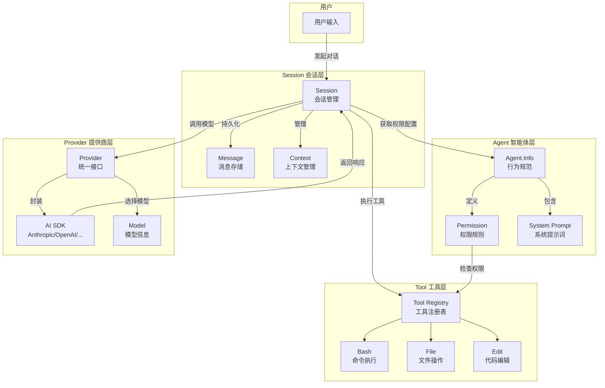

# OpenCode 完整分析文档

## 目录

1. [项目概览](#1-项目概览)
2. [核心概念与架构](#2-核心概念与架构)
3. [Agent 模块](#3-agent-模块)
4. [Permission 模块](#4-permission-模块)
5. [Config 模块](#5-config-模块)
6. [Session 模块](#6-session-模块)
7. [数据库设计](#7-数据库设计)
8. [配置详解](#8-配置详解)
9. [用户输入处理流程](#9-用户输入处理流程)

---

## 1. 项目概览

### 1.1 基本信息

| 属性         | 值                   |
| ------------ | -------------------- |
| **项目名称** | OpenCode             |
| **版本**     | 1.3.2                |
| **类型**     | AI 编程助手          |
| **语言**     | TypeScript           |
| **运行时**   | Bun                  |
| **许可证**   | MIT                  |
| **代码规模** | 1345 文件 / 37568 行 |

### 1.2 一句话描述

开源 AI 编程助手，类似 Claude Code，支持多模型提供商，内置 LSP 和 MCP 支持。

### 1.3 核心包结构

| 包名                | 文件数 | 代码行 | 职责            |
| ------------------- | ------ | ------ | --------------- |
| `packages/opencode` | 459    | 101010 | 核心 CLI 和后端 |
| `packages/app`      | 287    | 64852  | Web UI          |
| `packages/console`  | 194    | 36447  | 控制台应用      |
| `packages/ui`       | 177    | 27369  | UI 组件库       |
| `packages/sdk`      | 40     | 18259  | JavaScript SDK  |

### 1.4 核心依赖

- **AI SDK**: `ai` (Vercel AI SDK) + 20+ 提供商适配器
- **运行时**: `bun` + `effect` (函数式编程框架)
- **前端**: `solid-js` + `hono` (HTTP 服务)
- **数据库**: `drizzle-orm` + SQLite
- **开发工具**: `tree-sitter` (代码解析)

### 1.5 目录树

```
opencode/
├── packages/                    # 核心包目录
│   ├── opencode/               # 核心 CLI 和后端逻辑
│   ├── app/                    # Web UI
│   ├── console/                # 控制台 Web 应用
│   ├── ui/                     # UI 组件库
│   ├── sdk/                    # JavaScript SDK
│   └── ...
├── infra/                      # AWS 基础设施配置
├── specs/                      # 规格文档
└── .opencode/                  # OpenCode 自身配置
```

### 1.6 核心包目录结构

```
packages/opencode/src/
├── agent/           # Agent 定义和生成
├── session/         # 会话管理
├── provider/        # AI 模型提供商
├── tool/            # 工具系统
├── mcp/             # MCP 集成
├── lsp/             # LSP 集成
├── cli/             # CLI 命令
├── storage/         # 数据存储
├── permission/      # 权限系统
├── bus/             # 事件总线
├── config/          # 配置管理
└── util/            # 工具函数
```

---

## 2. 核心概念与架构

### 2.1 问题与解决方案

**要解决的问题**: AI 模型只能生成文本，无法直接操作计算机。需要一个桥梁让 AI 能够真正帮助开发者完成编码工作。

**解决方案**:

- ✅ **开源可控**: 用户可以审查和修改代码
- ✅ **多模型支持**: 不绑定单一提供商
- ✅ **本地优先**: 敏感代码无需上传第三方服务器
- ✅ **LSP 集成**: 开箱即用的代码智能支持

### 2.2 核心概念清单

#### 概念 1: Agent

- **是什么**: 定义 AI 智能体的行为规范和权限边界
- **WHY 需要**: 不同任务需要不同的能力边界
- **WHY 这样实现**: 使用 Effect Service 模式，支持依赖注入和状态隔离

#### 概念 2: Session

- **是什么**: 对话的生命周期管理单元
- **WHY 需要**: 持久化对话历史，支持上下文管理和会话分支
- **WHY 这样实现**: SQLite 存储 + 事件驱动更新

#### 概念 3: Provider

- **是什么**: AI 模型提供商的统一抽象层
- **WHY 需要**: 消除不同 AI API 的差异
- **WHY 这样实现**: 适配器模式 + 动态模型发现

#### 概念 4: Tool

- **是什么**: AI 可调用的原子操作单元
- **WHY 需要**: 让 AI 能够操作计算机
- **WHY 这样实现**: 工厂模式 + 权限控制 + 输出截断

### 2.3 概念关系矩阵

| 关系类型 | 概念 A      | 概念 B     | WHY 这样关联                      |
| -------- | ----------- | ---------- | --------------------------------- |
| 依赖     | Session     | Agent      | 会话需要知道当前 Agent 的权限配置 |
| 依赖     | Session     | Provider   | 会话需要调用 AI 模型              |
| 依赖     | Session     | Tool       | 会话需要执行工具调用              |
| 组合     | Agent       | Permission | Agent 定义权限规则集              |
| 组合     | Provider    | Model      | Provider 包含可用模型列表         |
| 对比     | Agent.build | Agent.plan | 不同权限模式：全功能 vs 只读      |

### 2.4 核心概念交互流程图



### 2.5 设计模式分析

| 模式            | 应用位置                          | WHY 使用                             |
| --------------- | --------------------------------- | ------------------------------------ |
| 适配器模式      | Provider 模块                     | 统一 20+ AI 提供商的接口差异         |
| 工厂模式        | Tool.define, createOpencodeClient | 统一创建复杂对象，自动添加横切关注点 |
| 策略模式        | Edit 工具的替换策略，权限评估     | 灵活切换不同算法，易于扩展           |
| 观察者模式      | Bus 事件系统，SSE 实时更新        | 解耦事件发布者和订阅者               |
| Effect 服务模式 | 所有核心服务                      | 函数式依赖注入，测试友好             |

---

## 3. Agent 模块

### 3.1 模块概览

| 属性         | 值                                                |
| ------------ | ------------------------------------------------- |
| **模块名称** | Agent                                             |
| **文件位置** | `packages/opencode/src/agent/`                    |
| **主文件**   | `agent.ts` (414 行)                               |
| **依赖模块** | Permission, Provider, Config, Auth, Skill, Plugin |
| **被依赖**   | Session, Tool, Server, CLI                        |

### 3.2 一句话描述

Agent 模块定义了 AI 智能体的**行为规范**和**权限边界**，是 OpenCode 实现"不同任务使用不同能力"的核心抽象。

### 3.3 生活类比

**Agent 就是一个"岗位定义"**：

```
┌─────────────────────────────────────────────────────────────┐
│                        公司 = OpenCode                       │
├─────────────────────────────────────────────────────────────┤
│                                                             │
│   ┌─────────┐    ┌─────────┐    ┌─────────┐               │
│   │  开发者  │    │  审计员  │    │  研究员  │               │
│   │ (build) │    │ (plan)  │    │(explore)│               │
│   └────┬────┘    └────┬────┘    └────┬────┘               │
│        │              │              │                     │
│   ✅ 写代码        ❌ 不能改代码    ✅ 搜索文件             │
│   ✅ 执行命令      ✅ 可以读代码    ✅ 读取文件             │
│   ✅ 读文件        ✅ 写计划文档    ❌ 不能改代码           │
│   ✅ 问用户问题    ❌ 不能执行命令  ❌ 不能执行命令         │
│                                                             │
└─────────────────────────────────────────────────────────────┘
```

### 3.4 核心定义

```
Agent = 权限配置 + 专业提示词 + 元信息
```

```typescript
// agent.ts:27-52
export const Info = z.object({
  // ===== 元信息 =====
  name: z.string(),                    // "build", "plan"...
  mode: z.enum(["subagent", "primary", "all"]),
  hidden: z.boolean().optional(),      // 是否隐藏
  description: z.string().optional(),  // 描述

  // ===== 权限配置 =====
  permission: Permission.Ruleset,      // 核心权限！

  // ===== 专业提示词 =====
  prompt: z.string().optional(),       // 系统提示词

  // ===== 其他配置 =====
  model: z.object({...}).optional(),   // 指定模型
  temperature: z.number().optional(),  // 温度参数
})
```

### 3.5 权限的三种动作

```
┌─────────────────────────────────────────────────────────────┐
│                      权限动作 (Action)                       │
├─────────────────────────────────────────────────────────────┤
│                                                             │
│   ✅ allow   →  直接执行，不问用户                           │
│   ❌ deny    →  直接拒绝，报错                               │
│   ❓ ask     →  弹窗询问用户："允许执行这个操作吗？"          │
│                                                             │
└─────────────────────────────────────────────────────────────┘
```

### 3.6 权限规则结构

每条规则回答三个问题：

```
┌─────────────────────────────────────────────────────────────┐
│                     Permission.Rule                          │
├─────────────────────────────────────────────────────────────┤
│                                                             │
│   permission: "bash"    ← 对哪个工具？                       │
│   pattern: "*"          ← 对什么范围？                       │
│   action: "allow"       ← 做什么动作？                       │
│                                                             │
│   解读：对所有 bash 命令，直接允许执行                        │
│                                                             │
└─────────────────────────────────────────────────────────────┘
```

### 3.7 权限评估算法（15行核心代码）

```typescript
// permission/evaluate.ts:9-15
export function evaluate(permission: string, pattern: string, ...rulesets: Rule[][]): Rule {
  const rules = rulesets.flat() // 把多层规则合并成一维数组
  const match = rules.findLast(
    // 从后往前找，后面的覆盖前面的
    (rule) => Wildcard.match(permission, rule.permission) && Wildcard.match(pattern, rule.pattern),
  )
  return match ?? { action: "ask", permission, pattern: "*" } // 没找到默认询问
}
```

**关键理解**：`findLast()` 确保后定义的规则优先级更高。

### 3.8 权限合并机制

```
┌─────────────────────────────────────────────────────────────┐
│                      权限合并示意                            │
├─────────────────────────────────────────────────────────────┤
│                                                             │
│   defaults:                                                 │
│   ┌─────────────────────────────────┐                      │
│   │ question: deny                  │                      │
│   │ bash: allow                     │                      │
│   │ edit: allow                     │                      │
│   └─────────────────────────────────┘                      │
│                      ↓  合并                                 │
│   Agent 特定配置:                                           │
│   ┌─────────────────────────────────┐                      │
│   │ question: allow    ← 覆盖 deny  │                      │
│   │ plan_enter: allow  ← 新增       │                      │
│   └─────────────────────────────────┘                      │
│                      ↓  合并                                 │
│   用户配置:                                                 │
│   ┌─────────────────────────────────┐                      │
│   │ bash: ask         ← 覆盖 allow  │                      │
│   └─────────────────────────────────┘                      │
│                                                             │
│   最终结果:                                                 │
│   ┌─────────────────────────────────┐                      │
│   │ question: allow                 │                      │
│   │ bash: ask                       │                      │
│   │ edit: allow                     │                      │
│   │ plan_enter: allow               │                      │
│   └─────────────────────────────────┘                      │
│                                                             │
└─────────────────────────────────────────────────────────────┘
```

### 3.9 内置 Agent 对比

| Agent   | mode     | 权限特点                  | 用途       |
| ------- | -------- | ------------------------- | ---------- |
| build   | primary  | 允许 question、plan_enter | 日常开发   |
| plan    | primary  | 禁止编辑，允许 plan_exit  | 只读规划   |
| general | subagent | 禁止 todo 工具            | 通用子任务 |
| explore | subagent | 只允许搜索和读取          | 代码库探索 |

### 3.10 权限合并优先级

```
低优先级 → 高优先级：
─────────────────────────────────────────────────────
1. Agent 内置 defaults
2. Agent 特定配置
3. 用户全局 permission
4. 用户 agent.xxx.permission
5. 运行时用户批准（always）
─────────────────────────────────────────────────────
evaluate() 使用 findLast() → 后定义的规则生效
```

---

## 4. Permission 模块

### 4.1 模块概览

**位置**: `packages/opencode/src/permission/`

**核心职责**: 运行时权限检查、权限请求/回复流程、权限状态持久化

**文件结构**:

```
permission/
├── index.ts      # 主模块：类型定义、服务、核心函数
├── evaluate.ts   # 权限评估算法（仅15行）
├── schema.ts     # PermissionID 类型定义
└── arity.ts      # Bash 命令参数识别
```

### 4.2 核心类型

```typescript
// 单条规则
export const Rule = z.object({
  permission: z.string(), // 权限名称，如 "bash", "edit"
  pattern: z.string(), // 匹配模式，如 "*", "rm", "src/*"
  action: Action, // 动作
})

// 规则集 = 规则数组
export const Ruleset = Rule.array()
```

### 4.3 Permission 服务接口

```typescript
export interface Interface {
  readonly ask: (input: AskInput) => Effect.Effect<void, Error>
  readonly reply: (input: ReplyInput) => Effect.Effect<void>
  readonly list: () => Effect.Effect<Request[]>
}
```

### 4.4 ask() 流程

```
┌─────────────────────────────────────────────────────────────────┐
│                        Permission.ask()                         │
├─────────────────────────────────────────────────────────────────┤
│  1. 遍历所有 patterns                                            │
│     ├── evaluate() 返回 deny → 抛出 DeniedError                  │
│     └── evaluate() 返回 allow → 跳过                             │
│                                                                 │
│  2. 全部 allow 或存在 deny → 直接返回                            │
│                                                                 │
│  3. 存在 ask → 创建 Deferred，加入 pending，发布 Asked 事件      │
│                                                                 │
│  4. 等待 Deferred.await()（阻塞直到用户回复）                    │
└─────────────────────────────────────────────────────────────────┘
```

### 4.5 权限检查流程

```
用户执行操作
     │
     ▼
┌─────────────────┐
│  Tool.execute() │
└────────┬────────┘
         │ ctx.ask({ permission, patterns, always })
         ▼
┌─────────────────┐
│ Permission.ask()│
└────────┬────────┘
         │
         ▼
    ┌────────────────────────────────┐
    │  遍历 patterns，调用 evaluate() │
    └────────────────┬───────────────┘
                     │
         ┌───────────┼───────────┐
         ▼           ▼           ▼
      [deny]      [allow]      [ask]
         │           │           │
         ▼           │           ▼
   DeniedError       │    ┌─────────────────┐
                     │    │ 发布 Asked 事件  │
                     │    │ 等待用户回复     │
                     │    └────────┬────────┘
                     │             │
                     │    ┌────────┼────────┐
                     │    ▼        ▼        ▼
                     │ [reject]  [once]  [always]
                     │    │        │        │
                     │    ▼        │        ▼
                     │ Rejected   │   保存规则
                     │ Error      │   到 approved
                     │            │
                     └────────────┴──────▶ 继续
```

### 4.6 与其他模块的关系

```
                ┌──────────────┐
                │    Config    │  配置文件中的 permission 字段
                └──────┬───────┘
                       │ fromConfig()
                       ▼
┌──────────────┐    ┌──────────────┐    ┌──────────────┐
│    Agent     │───▶│  Permission  │◀───│   Session    │
│              │    │              │    │              │
│ permission:  │    │ evaluate()   │    │ ask/reply    │
│ Ruleset      │    │ ask/reply    │    │ 持久化状态   │
└──────────────┘    └──────┬───────┘    └──────────────┘
                          │
                          ▼
                   ┌──────────────┐
                   │     Tool     │
                   │              │
                   │ ctx.ask()    │
                   └──────────────┘
```

### 4.7 关键函数

| 函数           | 作用             | 位置            |
| -------------- | ---------------- | --------------- |
| `evaluate()`   | 评估权限规则     | `evaluate.ts:9` |
| `fromConfig()` | 配置转规则集     | `index.ts:278`  |
| `merge()`      | 合并规则集       | `index.ts:292`  |
| `ask()`        | 请求权限         | `index.ts:166`  |
| `reply()`      | 回复权限         | `index.ts:203`  |
| `disabled()`   | 获取禁用工具列表 | `index.ts:298`  |

---

## 5. Config 模块

### 5.1 模块概览

**位置**: `packages/opencode/src/config/`

**核心职责**: 管理所有用户可自定义的设置项，包括模型选择、Agent 配置、权限规则、MCP 服务器、LSP、格式化器等。

### 5.2 配置文件位置

按优先级从低到高：

1. `~/.config/opencode/opencode.json` - 全局用户配置
2. 项目根目录 `opencode.json` - 项目配置
3. `.opencode/opencode.json` - 项目目录配置
4. 环境变量 `OPENCODE_CONFIG_CONTENT` - 内联配置

### 5.3 Config.Info 主配置结构

```typescript
export const Info = z.object({
  // 元信息
  $schema: z.string().optional(),
  logLevel: z.enum(["debug", "info", "warn", "error"]).optional(),

  // 模型配置
  model: z.string().optional(),           // 默认模型
  small_model: z.string().optional(),     // 小模型
  default_agent: z.string().optional(),   // 默认 agent

  // 用户信息
  username: z.string().optional(),

  // Agent 配置
  agent: z.record(z.string(), Agent).optional(),

  // 权限配置
  permission: Permission.optional(),

  // Provider 配置
  provider: z.record(z.string(), Provider).optional(),

  // MCP 配置
  mcp: z.record(z.string(), Mcp).optional(),

  // LSP 配置
  lsp: z.record(...).optional(),

  // ... 更多配置
})
```

### 5.4 Config.Agent 结构

```typescript
export const Agent = z.object({
  model: z.string().optional(), // 专用模型
  variant: z.string().optional(), // 模型变体
  prompt: z.string().optional(), // 自定义提示词
  temperature: z.number().optional(), // 温度参数
  mode: z.enum(["subagent", "primary", "all"]).optional(),
  permission: Permission.optional(), // 权限规则
  description: z.string().optional(), // 描述
})
```

### 5.5 Config.Permission 结构

```typescript
// Permission 可以是三种形式：

// 1. 全局字符串 - 对所有工具生效
"allow" | "deny" | "ask"

// 2. 工具级别配置
{
  "read": "allow",
  "edit": "ask",
  "bash": "deny"
}

// 3. 带模式的细粒度配置
{
  "bash": {
    "*": "ask",
    "git status": "allow",
    "npm *": "allow"
  },
  "edit": {
    "*": "ask",
    "*.json": "allow"
  }
}
```

### 5.6 配置加载优先级

```
优先级  配置来源                           说明
────────────────────────────────────────────────────────────────────────
  1     Remote .well-known/opencode       组织级远程配置
  2     Global ~/.config/opencode/        用户全局配置
  3     OPENCODE_CONFIG                   环境变量指定路径
  4     Project opencode.json             项目根目录配置
  5     .opencode/opencode.json           .opencode 目录配置
  6     OPENCODE_CONFIG_CONTENT           内联配置（最高）
  7     Enterprise managed                企业托管配置（覆盖所有）
```

### 5.7 特殊变量替换

Config 支持在配置文件中使用特殊变量：

```json
{
  "provider": {
    "anthropic": {
      "apiKey": "{env:ANTHROPIC_API_KEY}"
    },
    "openai": {
      "apiKey": "{file:~/.openai_key}"
    }
  }
}
```

| 变量          | 说明         | 示例                      |
| ------------- | ------------ | ------------------------- |
| `{env:VAR}`   | 环境变量替换 | `{env:ANTHROPIC_API_KEY}` |
| `{file:PATH}` | 文件内容替换 | `{file:~/.secret/key}`    |

### 5.8 配置数据流向图

```
        配置来源 (优先级从低到高)
               │
               │ 读取 + 解析 (paths.ts)
               ↓
        ConfigPaths.parseText()
        - {env:VAR} 环境变量替换
        - {file:PATH} 文件内容替换
        - JSONC 解析 (允许注释、尾逗号)
               │
               │ 加载各类型配置 (config.ts)
               ↓
        Config.state()
        - loadFile() 加载 JSON 配置
        - loadAgent() 加载 .opencode/agents/*.md
        - loadCommand() 加载 .opencode/commands/*.md
        - loadPlugin() 加载 .opencode/plugins/*.ts
               │
               │ 合并
               ↓
        Config.Info (最终配置对象)
               │
               │ 分发到各模块
               ↓
        Agent.Service / Permission.Service / Provider.Service / ...
```

---

## 6. Session 模块

### 6.1 模块概览

**位置**: `packages/opencode/src/session/`

**核心职责**: 管理 AI 对话的生命周期，包括会话创建、消息存储、LLM 交互、工具调用、压缩优化等功能。

### 6.2 Session 的核心职责

```
┌─────────────────────────────────────────────────────────────────────────────┐
│                          Session 模块核心职责                                 │
└─────────────────────────────────────────────────────────────────────────────┘

  1. 会话管理        创建、查询、更新、删除会话
  2. 消息存储        用户消息、AI 响应、工具调用的持久化
  3. LLM 交互        与 AI 模型的流式通信
  4. 工具执行        工具调用的处理和结果返回
  5. 上下文管理      压缩、修剪、快照管理
  6. 分享功能        会话的分享和取消分享
```

### 6.3 Session 与 Project 的关系

```
Project (项目)
    │
    │ 一个项目可以有多个 Session
    ↓
Session (会话)
    │
    │ 一个 Session 包含多条 Message
    ↓
Message (消息)
    │
    │ 一条 Message 包含多个 Part
    ↓
Part (消息部分)
    │
    │ types: text, tool, reasoning, file, snapshot...
```

### 6.4 模块文件结构

```
src/session/
├── index.ts           # Session 命名空间 + CRUD 操作
├── session.sql.ts     # 数据库表定义
├── schema.ts          # 类型定义
├── message-v2.ts      # Message/Part 结构定义
├── processor.ts       # LLM 响应处理器
├── llm.ts             # LLM 流式调用封装
├── system.ts          # 系统提示词生成
├── prompt.ts          # 用户提示处理
├── compaction.ts      # 上下文压缩
└── ...
```

### 6.5 Session.Info 结构

```typescript
export const Info = z.object({
  id: SessionID, // 会话唯一标识
  slug: z.string(), // URL友好标识
  projectID: ProjectID, // 所属项目
  directory: z.string(), // 工作目录
  parentID: SessionID, // 父会话（子会话场景）
  title: z.string(), // 会话标题
  permission: Permission.Ruleset, // 权限规则
  time: z.object({
    created: z.number(),
    updated: z.number(),
  }),
  // ... 更多字段
})
```

### 6.6 MessageV2.Part 类型

```typescript
export const Part = z.discriminatedUnion("type", [
  // 文本内容
  { type: "text", text: z.string() },

  // 推理过程（思维链）
  { type: "reasoning", text: z.string() },

  // 工具调用
  { type: "tool", tool: z.string(), callID: z.string(), state: ToolState },

  // 文件附件
  { type: "file", mime: z.string(), url: z.string() },

  // 快照（文件状态）
  { type: "snapshot", snapshot: z.string() },

  // 步骤开始/结束
  { type: "step-start", snapshot: z.string() },
  { type: "step-finish", tokens, cost, reason },

  // ... 更多类型
])
```

### 6.7 ToolState 状态机

```
                    ┌─────────────┐
                    │   pending   │  工具调用开始
                    └─────────────┘
                          │
                          │ 参数解析完成
                          ↓
                    ┌─────────────┐
                    │   running   │  工具正在执行
                    └─────────────┘
                          │
            ┌─────────────┼─────────────┐
            │             │             │
            ↓             ↓             ↓
      ┌───────────┐ ┌───────────┐ ┌───────────┐
      │ completed │ │   error   │ │  (用户拒绝)│
      └───────────┘ └───────────┘ └───────────┘
```

### 6.8 数据流架构图

```
     用户输入
         │
         ↓
    ┌────────────────┐
    │ Session.create │  创建/获取 Session
    └────────────────┘
         │
         ↓
    ┌────────────────┐
    │ MessageV2.User │  创建用户消息
    │   + Parts      │  (text, file, agent...)
    └────────────────┘
         │
         ↓
    ┌────────────────┐
    │ LLM.stream()   │  调用 LLM API
    └────────────────┘
         │
         │ 流式响应
         ↓
    ┌────────────────┐
    │ SessionProcess │  处理响应流
    │   .process()   │  (文本、工具调用、推理...)
    └────────────────┘
         │
         │ 工具调用
         ↓
    ┌────────────────┐
    │ Tool.Registry  │  执行工具
    │   .execute()   │
    └────────────────┘
         │
         │ 循环直到完成
         ↓
    ┌────────────────┐
    │ MessageV2.     │  创建助手消息
    │   Assistant    │
    │   + Parts      │
    └────────────────┘
```

### 6.9 上下文压缩

**触发条件**: `isOverflow()` 返回 true（tokens >= context_limit - reserved）

**压缩流程**:

1. `prune()` - 修剪旧工具输出
2. 创建压缩消息（Agent: "compaction"）
3. 调用 LLM 生成摘要
4. 创建 CompactionPart 标记压缩点

---

## 7. 数据库设计

### 7.1 概述

OpenCode 使用 SQLite + Drizzle ORM，数据库文件位于 `xdgData/opencode/opencode.db`。

共有 **11 个表**，分为以下模块：

- **账户模块**：account、account_state、control_account
- **项目模块**：project、workspace
- **会话模块**：session、message、part、todo、permission
- **分享模块**：session_share

### 7.2 表关系图

```
账户模块
┌───────────────┐     ┌─────────────────────┐     ┌──────────────────────┐
│    account    │────>│   account_state     │     │  control_account     │
│  (账户信息)   │     │  (当前激活账户)     │     │   (遗留，已弃用)     │
└───────────────┘     └─────────────────────┘     └──────────────────────┘
       │
       ↓
项目模块
┌─────────────────────┐
│      project        │
│    (项目信息)       │
└─────────────────────┘
       │
       ├──────────────────────────────────┐
       ↓                                  ↓
┌─────────────────────┐           ┌─────────────────────┐
│     workspace       │           │     permission      │
│   (远程工作区)      │           │   (权限规则)        │
└─────────────────────┘           └─────────────────────┘
       │
       ↓
会话模块
┌─────────────────────┐
│      session        │
│    (会话信息)       │
└─────────────────────┘
       │
       ├──────────────────┬───────────────────┐
       ↓                  ↓                   ↓
┌─────────────────────┐  ┌─────────────────────┐  ┌─────────────────────┐
│      message        │  │        todo         │  │   session_share     │
│    (消息记录)       │  │     (任务列表)      │  │   (会话分享)        │
└─────────────────────┘  └─────────────────────┘  └─────────────────────┘
       │
       ↓
┌─────────────────────┐
│        part         │
│   (消息部分内容)    │
└─────────────────────┘
```

### 7.3 核心表说明

#### session 表

| 字段           | 类型                      | 说明                    |
| -------------- | ------------------------- | ----------------------- |
| `id`           | SessionID (text)          | 主键                    |
| `project_id`   | ProjectID (text)          | 所属项目 ID             |
| `parent_id`    | SessionID (text)          | 父会话 ID（子会话场景） |
| `slug`         | text                      | URL友好标识             |
| `title`        | text                      | 会话标题                |
| `permission`   | Permission.Ruleset (json) | 权限规则集              |
| `time_created` | integer                   | 创建时间                |

#### message 表

| 字段         | 类型             | 说明         |
| ------------ | ---------------- | ------------ |
| `id`         | MessageID (text) | 主键         |
| `session_id` | SessionID (text) | 所属会话 ID  |
| `data`       | InfoData (json)  | 消息内容数据 |

#### part 表

| 字段         | 类型             | 说明         |
| ------------ | ---------------- | ------------ |
| `id`         | PartID (text)    | 主键         |
| `message_id` | MessageID (text) | 所属消息 ID  |
| `session_id` | SessionID (text) | 所属会话 ID  |
| `data`       | PartData (json)  | 部分内容数据 |

### 7.4 删除策略

| 策略       | 说明           | 使用场景                                     |
| ---------- | -------------- | -------------------------------------------- |
| `cascade`  | 级联删除子记录 | project→session/message/workspace/permission |
| `set null` | 设为 NULL      | account_state→account                        |

---

## 8. 配置详解

### 8.1 完整配置示例

```json
{
  "$schema": "https://opencode.ai/config.json",

  "model": "anthropic/claude-3.5-sonnet",
  "small_model": "openai/gpt-4o-mini",
  "default_agent": "build",
  "username": "developer",

  "autoupdate": true,
  "snapshot": true,
  "share": "manual",

  "agent": {
    "build": {
      "model": "anthropic/claude-3.5-sonnet",
      "temperature": 0.7,
      "steps": 50
    }
  },

  "permission": {
    "bash": "ask",
    "edit": { "src/*": "allow", "*.env": "deny" }
  },

  "provider": {
    "anthropic": {
      "options": { "apiKey": "your-api-key" }
    }
  },

  "mcp": {
    "my-server": {
      "type": "local",
      "command": ["node", "server.js"]
    }
  },

  "compaction": {
    "auto": true,
    "prune": true
  }
}
```

### 8.2 权限配置详解

```json
{
  "permission": {
    "bash": "deny",
    "bash": "ask",
    "bash": { "rm -rf *": "deny", "git *": "allow" },
    "edit": "allow",
    "edit": { "src/*": "allow", "*.env": "deny" },
    "read": { "*.env": "ask", "*": "allow" }
  }
}
```

**权限值说明**：

| 值        | 说明         |
| --------- | ------------ |
| `"allow"` | 直接允许     |
| `"deny"`  | 直接拒绝     |
| `"ask"`   | 每次询问用户 |

**支持的工具权限**：

| 权限名               | 说明          |
| -------------------- | ------------- |
| `bash`               | Bash 命令执行 |
| `edit`               | 文件编辑      |
| `read`               | 文件读取      |
| `glob`               | 文件模式搜索  |
| `grep`               | 内容搜索      |
| `task`               | 子任务调用    |
| `webfetch`           | 网页获取      |
| `websearch`          | 网页搜索      |
| `external_directory` | 外部目录访问  |

### 8.3 Agent 配置详解

```json
{
  "agent": {
    "build": {
      "model": "anthropic/claude-3.5-sonnet",
      "temperature": 0.7,
      "steps": 50,
      "prompt": "你是一个专业的开发助手...",
      "permission": {
        "bash": { "rm -rf *": "deny" }
      }
    },
    "my-custom-agent": {
      "mode": "subagent",
      "model": "openai/gpt-4o-mini",
      "permission": {
        "edit": "deny"
      }
    }
  }
}
```

### 8.4 MCP 配置详解

```json
{
  "mcp": {
    "my-local-server": {
      "type": "local",
      "command": ["node", "path/to/server.js"],
      "environment": { "API_KEY": "secret" },
      "enabled": true,
      "timeout": 5000
    },
    "my-remote-server": {
      "type": "remote",
      "url": "https://api.example.com/mcp",
      "headers": { "Authorization": "Bearer token" },
      "enabled": true
    }
  }
}
```

---

## 9. 用户输入处理流程

### 9.1 完整流程概览

```
用户输入
    │
    ↓
┌─────────────────────────────────────────────────────────────────────────────┐
│  1. HTTP API 入口                                                            │
│  POST /:sessionID/message                                                    │
└─────────────────────────────────────────────────────────────────────────────┘
    │
    ↓
┌─────────────────────────────────────────────────────────────────────────────┐
│  2. 创建用户消息 (MessageV2.User)                                            │
│  - 解析 parts (text, file, agent)                                            │
│  - 持久化到数据库                                                            │
└─────────────────────────────────────────────────────────────────────────────┘
    │
    ↓
┌─────────────────────────────────────────────────────────────────────────────┐
│  3. 进入主循环 (loop)                                                        │
│  while (true) { step++; ... }                                                │
└─────────────────────────────────────────────────────────────────────────────┘
    │
    ↓
┌─────────────────────────────────────────────────────────────────────────────┐
│  4. 获取上下文                                                               │
│  - MessageV2.stream(sessionID) - 从数据库流式加载所有消息                    │
│  - 提取 lastUser, lastAssistant, tasks 等                                    │
└─────────────────────────────────────────────────────────────────────────────┘
    │
    ↓
┌─────────────────────────────────────────────────────────────────────────────┐
│  5. 获取 Agent 和 Model                                                      │
│  - Agent.get(lastUser.agent) - 返回 agent 配置                               │
│  - Provider.getModel(providerID, modelID) - 返回模型配置                     │
└─────────────────────────────────────────────────────────────────────────────┘
    │
    ↓
┌─────────────────────────────────────────────────────────────────────────────┐
│  6. 创建助手消息 (MessageV2.Assistant)                                        │
│  - 初始化 cost: 0, tokens: { input: 0, output: 0 }                           │
└─────────────────────────────────────────────────────────────────────────────┘
    │
    ↓
┌─────────────────────────────────────────────────────────────────────────────┐
│  7. 解析工具列表                                                             │
│  - ToolRegistry.tools(model, agent) - 获取所有可用工具                       │
│  - Permission.disabled(tools, ruleset) - 过滤被 deny 的工具                  │
│  - MCP.tools() - 添加 MCP 服务器提供的工具                                   │
└─────────────────────────────────────────────────────────────────────────────┘
    │
    ↓
┌─────────────────────────────────────────────────────────────────────────────┐
│  8. 构建系统提示                                                             │
│  - SystemPrompt.environment(model) - 环境信息                                │
│  - SystemPrompt.skills(agent) - 可用技能                                     │
│  - InstructionPrompt.system() - 自定义指令                                   │
│  - SystemPrompt.provider(model) - 根据模型选择提示词模板                     │
└─────────────────────────────────────────────────────────────────────────────┘
    │
    ↓
┌─────────────────────────────────────────────────────────────────────────────┐
│  9. 转换消息格式 (MessageV2.toModelMessages)                                  │
│  - 将 MessageV2.WithParts[] 转换为 AI SDK 的 ModelMessage[]                  │
└─────────────────────────────────────────────────────────────────────────────┘
    │
    ↓
┌─────────────────────────────────────────────────────────────────────────────┐
│  10. 调用 processor.process()                                                │
└─────────────────────────────────────────────────────────────────────────────┘
    │
    ↓
┌─────────────────────────────────────────────────────────────────────────────┐
│  11. LLM.stream() - 流式调用 AI                                              │
│  - 获取 Provider 和 Auth                                                     │
│  - 构建最终系统提示                                                          │
│  - 计算模型参数 (temperature, maxTokens)                                     │
│  - streamText() - AI SDK 调用                                                │
└─────────────────────────────────────────────────────────────────────────────┘
    │
    ↓
┌─────────────────────────────────────────────────────────────────────────────┐
│  12. SessionProcessor.process() - 处理流式响应                               │
│  for await (const value of stream.fullStream) { ... }                       │
│                                                                              │
│  处理事件类型:                                                                │
│  - text-start/delta/end → TextPart                                          │
│  - reasoning-start/delta/end → ReasoningPart                                │
│  - tool-call → ToolPart (执行工具)                                          │
│  - finish-step → StepFinishPart                                             │
└─────────────────────────────────────────────────────────────────────────────┘
    │
    │ 工具调用
    ↓
┌─────────────────────────────────────────────────────────────────────────────┐
│  13. 工具执行                                                                │
│  - Permission.ask() - 检查权限规则                                           │
│  - ToolRegistry.get(toolName).execute(args, context)                        │
│  返回: { output, title, metadata }                                          │
└─────────────────────────────────────────────────────────────────────────────┘
    │
    ↓
┌─────────────────────────────────────────────────────────────────────────────┐
│  14. finish-step 处理                                                        │
│  - Snapshot.track() - 记录文件系统状态                                       │
│  - 创建 StepFinishPart                                                       │
│  - Snapshot.patch() - 比较文件变化，创建 PatchPart                           │
│  - SessionSummary.summarize() - 更新会话的代码统计                           │
└─────────────────────────────────────────────────────────────────────────────┘
    │
    │ 如果 tokens >= context_limit
    ↓
┌─────────────────────────────────────────────────────────────────────────────┐
│  15. 上下文压缩 (如果需要)                                                   │
│  - isOverflow() - 检查是否超过上下文限制                                     │
│  - prune() - 压缩旧的工具输出                                                │
│  - 使用 "compaction" agent 生成摘要                                         │
└─────────────────────────────────────────────────────────────────────────────┘
    │
    │ 如果 finish === "stop" 或 "length"
    ↓
┌─────────────────────────────────────────────────────────────────────────────┐
│  16. 循环结束                                                                │
│  - 检查 finish 原因                                                          │
│  - SessionCompaction.prune() - 清理旧的工具输出                              │
│  返回 MessageV2.WithParts                                                    │
└─────────────────────────────────────────────────────────────────────────────┘
```

### 9.2 关键步骤总结

| 步骤 | 说明                     | 文件位置                                 |
| ---- | ------------------------ | ---------------------------------------- |
| 1    | HTTP API 接收请求        | `server/routes/session.ts:783-822`       |
| 2    | 创建用户消息             | `session/prompt.ts:162-189`              |
| 3    | 进入主循环               | `session/prompt.ts:278-756`              |
| 4    | 加载历史消息             | `session/message-v2.ts`                  |
| 5    | 获取 Agent 和 Model      | `agent/agent.ts`, `provider/provider.ts` |
| 6    | 创建助手消息             | `session/prompt.ts:591-620`              |
| 7    | 解析工具列表             | `session/prompt.ts:765-900`              |
| 8    | 构建系统提示             | `session/system.ts`                      |
| 9    | 转换消息格式             | `session/message-v2.ts`                  |
| 10   | 调用 processor.process() | `session/prompt.ts:687`                  |
| 11   | LLM 流式调用             | `session/llm.ts:48-320`                  |
| 12   | 处理流式响应             | `session/processor.ts:46-350`            |
| 13   | 执行工具 (如需要)        | `tool/registry.ts`                       |
| 14   | 记录 tokens/cost         | `session/processor.ts:245-289`           |
| 15   | 上下文压缩 (如需要)      | `session/compaction.ts`                  |
| 16   | 循环结束判断             | `session/prompt.ts:719-744`              |

---

## 总结

OpenCode 是一个**设计精良的开源 AI 编程助手**，其核心亮点包括：

1. **Agent 系统**: 灵活的权限配置，支持多种工作模式
2. **Permission 模块**: 后定义优先的权限评估，状态持久化
3. **Config 模块**: 多层配置合并，支持环境变量和文件替换
4. **Session 模块**: 完整的会话生命周期，支持分支和压缩
5. **Provider 抽象**: 统一 20+ AI 提供商，支持动态模型发现
6. **Tool 框架**: 安全的工具执行，自动参数验证和输出截断

项目采用了 Effect 函数式编程框架，确保了代码的可测试性和可维护性。整体架构清晰，模块职责分明，是学习现代 TypeScript 项目设计的优秀范例。

---

## 附录：关键代码路径索引

| 功能         | 文件                     | 行号                              |
| ------------ | ------------------------ | --------------------------------- |
| Agent 定义   | `agent/agent.ts`         | L27-52 (Info), L84-101 (defaults) |
| 权限评估     | `permission/evaluate.ts` | L9-15                             |
| 权限合并     | `permission/index.ts`    | L292-294                          |
| 配置加载     | `config/config.ts`       | L78-266 (state)                   |
| Session 创建 | `session/index.ts`       | L297-338 (createNext)             |
| 消息处理     | `session/processor.ts`   | L46-350 (process)                 |
| LLM 调用     | `session/llm.ts`         | L48-320 (stream)                  |
| 上下文压缩   | `session/compaction.ts`  | L102-331 (process)                |
| 系统提示词   | `session/system.ts`      | L18-53                            |
